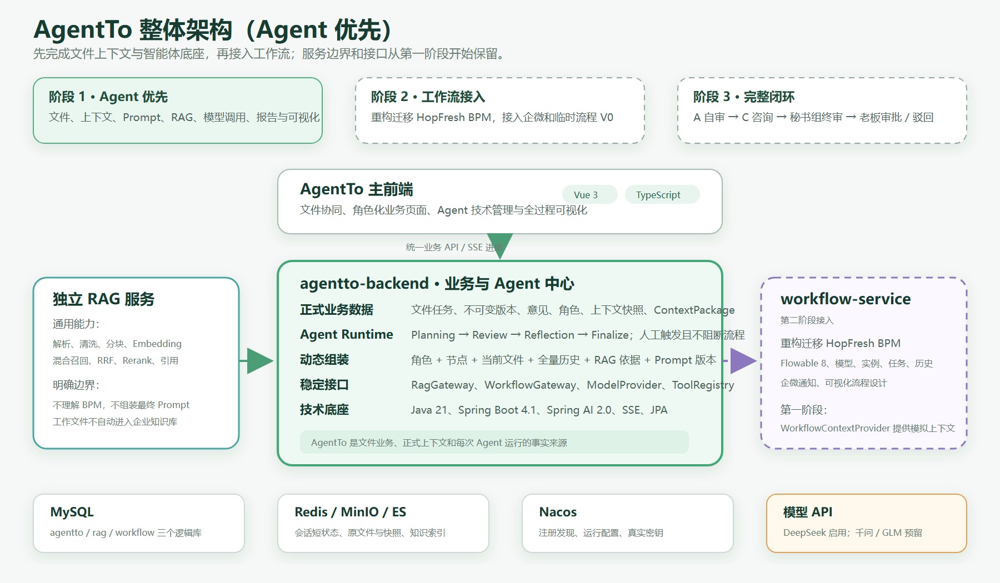
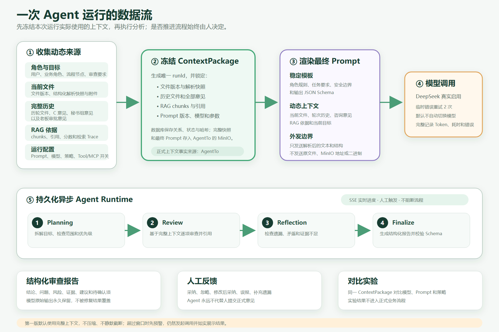
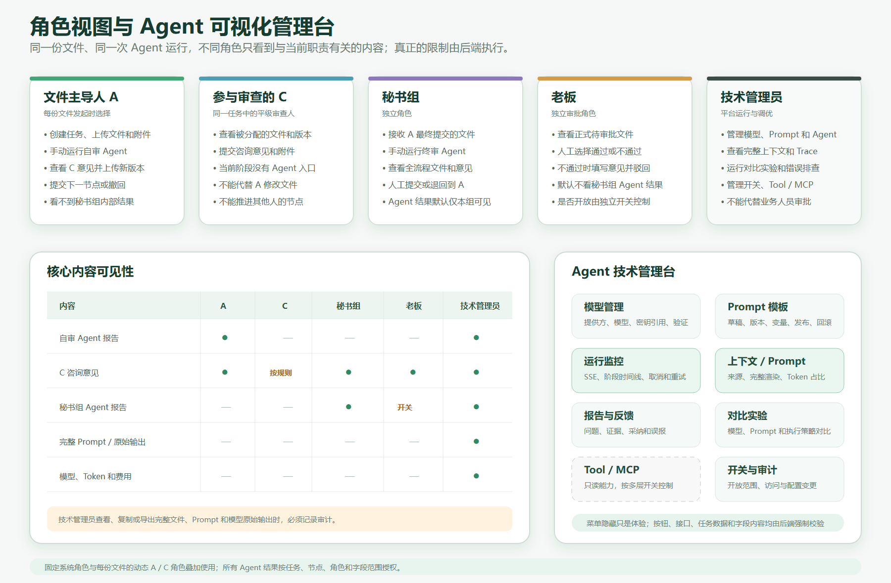

# AgentTo Agent 优先总体设计 V0.1

> 文档状态：内部设计稿  
> 更新时间：2026-07-16  
> 用途：作为后续详细设计、任务拆分和开发实现的统一依据  
> 说明：本文只记录已经讨论确认的设计。总经办尚未确认的工作流流转细节，会单独标明。

## 1. 当前结论

AgentTo 要建设的是一套以文件为中心的智能协同平台。系统不是单独的聊天工具，也不是把大模型嵌进一个审批页面，而是把文件版本、人工意见、企业知识、Agent 分析和正式工作流放到同一条可追溯链路中。

目前确定采用“Agent 优先、工作流后接”的实施顺序：

1. 先完成不依赖具体工作流的文件、上下文、Prompt、Agent Runtime、模型管理、RAG 接入和全过程可视化。
2. Agent 阶段通过稳定接口接收模拟的流程角色、节点、轮次和历史意见，不依赖 Flowable 才能启动。
3. 后续再建设独立的 `workflow-service`，重构迁移 HopFresh BPM 能力，并接入企微通知。
4. 总经办确认实际流转后，主要调整 BPMN 和节点规则，不改写文件、Agent、RAG 和上下文模块。

下周演示仍以完整闭环为目标。开发顺序先做 Agent，再使用临时流程 V0 接出 A 自审、C 咨询、秘书组终审和老板审批；总经办确认后替换临时流程定义。

## 2. 设计原则

### 2.1 工作流和 Agent 相互独立

正式任务必须在不使用 Agent 的情况下也能正常发起、提交、退回和审批。Agent 是辅助分析能力，不是流程合法性的前置条件。

- Agent 未运行、运行中或运行失败，都不能阻断人工操作。
- Agent 不修改文件，不上传新版本，不提交正式意见，不替人审批，也不自动推进流程。
- 是否采纳 Agent 结果由当前处理人决定，并留下反馈记录。

### 2.2 AgentTo 保存正式业务事实

文件任务、文件版本、意见、角色、解析快照、上下文包、最终 Prompt 和 Agent 运行结果，都以 AgentTo 保存的数据为准。

RAG 负责通用解析和检索，工作流服务负责流程状态，两者都不能替代 AgentTo 成为文件业务的事实来源。

### 2.3 所有智能过程都要可视化

系统不仅展示最终结论，还要让技术管理员看到：

- 文件怎么解析、清洗和形成快照；
- 本次运行使用了哪些文件、历史意见和 RAG 依据；
- Prompt 模板如何填充，最终发送了什么内容；
- Planning、Review、Reflection、Finalize 各阶段如何执行；
- 每次模型调用的耗时、Token、错误、重试和结构校验结果；
- 人工最终采纳、忽略或修正了哪些建议。

### 2.4 正式数据长期保留

正式文件、历史版本、意见、流程记录、完整 Prompt、模型原始输出、ContextPackage、Agent 报告和 RAG 解析档案都长期保留，不设置自动过期。

生产删除入口默认关闭。以后启用时，只允许技术管理员在填写原因并二次确认后操作，同时联动清理业务内容、对象存储、解析数据和索引；操作人、时间、对象 ID 和哈希等审计信息仍然保留。

## 3. 总体架构

整体分为三个可独立运行的后端服务：

| 服务 | 主要职责 | 不负责什么 |
|---|---|---|
| `agentto-backend` | 文件业务、身份权限、上下文、Prompt、Agent 编排、审查结果和技术管理 | 不直接操作 Flowable 表，不直接查询 RAG 索引 |
| `rag-service` | 通用文档解析、知识管理、混合检索、RRF、Rerank、引用和检索 Trace | 不理解 BPM，不组装最终 Prompt，不保存正式审批事实 |
| `workflow-service` | 流程模型、实例、任务、流转历史、任务操作和企微通知 | 不保存文件正文、完整意见、Prompt 和 Agent 结果 |

前端保持两套：

- AgentTo 主前端：承载文件协同、待办处理、角色化页面、Agent 技术管理和后续 BPM 页面。
- RAG 技术管理前端：继续维护解析、分块、索引、召回实验室、Rerank 和检索 Trace。

`workflow-service` 不单独建设一套业务前端。需要的 BPM 模型、实例、任务和历史页面，从 HopFresh 中选择性迁移到 AgentTo 主前端。

## 4. AgentTo 后端模块

第一阶段的 `agentto-backend` 保持为一个可独立启动的模块化单体，不把内部模块拆成多个微服务。模块之间通过应用服务接口协作，不允许跨模块随意修改表。

| 模块 | 职责 |
|---|---|
| `identity` | 用户、部门、固定角色、动态任务角色、权限和登录会话 |
| `file-task` | 文件任务、主文件、附件、不可变版本、咨询意见和版本哈希 |
| `document-context` | 解析引用、正式解析快照、轮次历史和 ContextPackage |
| `prompt` | Prompt 草稿、发布版本、变量定义、渲染、差异和回滚 |
| `model` | 模型提供方、模型能力、密钥引用、参数、Token 和费用 |
| `agent-definition` | 逻辑 Agent、角色、执行策略、模型、权限和功能开关 |
| `agent-runtime` | 异步运行、阶段状态、SSE、取消、重试、幂等和并发控制 |
| `agent-result` | 结构化报告、问题、证据、建议、人工反馈和对比实验 |
| `rag-integration` | 解析、检索、引用和 Trace 的稳定调用接口 |
| `workflow-integration` | 第一阶段提供模拟上下文，第二阶段接入真实工作流 |
| `tool-mcp` | 只读 Tool/MCP 注册、授权、执行和 Trace，可整体关闭 |
| `audit-governance` | 审计、功能开关、Outbox/Inbox、删除控制和敏感访问记录 |

只有在确实出现独立扩缩容、不同发布周期或明确团队边界时，才考虑将其中某个模块继续拆成独立服务。

## 5. Agent Runtime

### 5.1 一个运行引擎，多套逻辑 Agent

系统只建设一套共享的 Agent Runtime，不为每个部门复制一套代码。不同 Agent 通过配置区分角色、Prompt、模型、执行策略、可访问知识空间和 Tool 权限。

第一批逻辑 Agent 包括：

- 文件主导人自审 Agent；
- 秘书组终审 Agent。

C 审查阶段当前不接入 Agent。以后增加部门 Agent 时，新增的是 Agent 定义和权限配置，不是再开发一套运行引擎。

### 5.2 执行阶段

一次完整运行按照以下阶段执行：

1. **Planning**：拆解审查目标、检查范围和优先级。
2. **Review**：结合完整上下文逐项审查，形成问题、证据和建议。
3. **Reflection**：检查遗漏、矛盾、证据不足以及是否偏离目标。
4. **Finalize**：形成结构化报告和可阅读结论，并执行 JSON Schema 校验。

Planning、Review 和 Reflection 是同一个 Agent 内部的阶段，不是三个独立部署的 Agent。

执行策略可以配置为单次审查、Planning + Review 或完整四阶段。第一版默认使用完整四阶段。

### 5.3 运行控制

- 同一“文件任务 + 流程轮次 + Agent 类型”同时只允许一个正式运行。
- 技术后台的对比实验可以并行运行，但不进入正式流程。
- 运行中允许取消，已完成阶段和日志继续保留。
- 失败或取消后重新运行会生成新的 `runId`，并关联前一次运行。
- 已完成结果不可覆盖，只能创建新的运行记录。
- 后台任务使用持久化状态执行，前端通过 SSE 接收进度；页面断开不会终止任务，重新进入后按 `runId` 恢复。

第一阶段可使用 Spring 异步执行器和数据库状态。`AgentRunDispatcher` 必须保留稳定接口，后续可以在不修改业务编排的情况下换成消息队列。

## 6. 动态上下文与 Prompt

### 6.1 Prompt 模板与动态上下文

两者需要明确区分：

- Prompt 模板是相对稳定的基础结构，包含角色规则、任务要求、安全边界和输出 Schema。
- 动态上下文是本次运行实际使用的数据，会随着文件版本、流程轮次和历史意见增加。
- 最终 Prompt 是模板和动态上下文渲染后的完整结果，每次运行都单独保存。

Prompt 模板支持草稿、发布、版本、差异、回滚。一次 Agent 运行开始后，锁定具体 Prompt 版本，运行中不受模板后续修改影响。

### 6.2 ContextPackage

每次运行开始时先生成不可变的 ContextPackage，至少锁定：

- 当前用户、部门、业务角色和流程节点；
- 当前文件任务、文件版本和附件版本；
- 本次使用的正式解析快照；
- 之前轮次的文件内容和全部意见；
- RAG 返回的 chunks、引用、分数、检索参数和 Trace；
- Prompt 模板版本、模板变量及其来源；
- 模型、参数、执行策略和 Tool/MCP 开关；
- 输入内容哈希、Token 估算和各类来源 ID。

ContextPackage 冻结后，再使用其中锁定的模板版本、变量和动态数据渲染最终 Prompt。最终 Prompt 同样不可变，并通过 `runId` 与本次 ContextPackage 一一关联。

数据库保存对象关系、运行状态、版本和哈希。体积较大的解析快照、完整 ContextPackage、最终 Prompt 和模型原始输出存放在 AgentTo 的 MinIO 私有目录中。

即使以后 RAG 重新索引、解析器升级、Prompt 修改或模型切换，也能够还原一次历史运行实际使用的内容。

### 6.3 第一版上下文策略

第一版默认采用 `FULL_CONTEXT`：

- 直接使用完整文件内容和完整历史意见；
- 不主动压缩，不静默截断；
- 预计业务一般不超过三轮，但系统不把三轮设为硬限制；
- 估算超过模型上下文窗口时，在页面明确预警，仍然发起调用；
- 如果模型供应商拒绝请求，保存并展示真实错误，不伪造成功结果。

`COMPACT_CONTEXT` 可以保留实现和后台开关，但默认关闭，也不作为第一版演示口径。

Spring AI 的 ChatMemory 只用于模型运行时工作窗口，不能替代正式流程历史和 ContextPackage。

## 7. 文件解析与 RAG 边界

### 7.1 文件类型

第一版按以下范围处理：

- Word、可直接提取文字的 PDF 可以作为主文件；
- Excel 作为辅助材料，提取 Sheet、表头、单元格内容和位置；
- 暂不深度理解 Excel 公式计算、图表和复杂合并单元格；
- 扫描版 PDF 如果无法提取正文，明确提示需要 OCR，本阶段不继续调用 Agent；
- OCR 接口保留，后续单独设计。

### 7.2 解析过程

1. 原文件先存入 AgentTo 自己的 MinIO 私有目录。
2. AgentTo 通过受控接口交给 RAG 服务解析，不自动加入企业知识库。
3. RAG 返回标题、段落、表格、页码、清洗结果和分块结果。
4. AgentTo 保存一份不可变的正式解析快照，供后续 Agent 运行使用。

RAG 同时保留一份技术解析档案，包括 `parseJobId`、来源应用、业务文件 ID、文件哈希、解析器版本、清洗参数、分块策略、耗时、异常、降级状态和解析结果。它用于技术观察和复现，不是正式审批依据，也不能被普通企业知识检索召回。

原文件不在 RAG 中重复长期保存。RAG 通过短期授权读取文件，正式原件始终由 AgentTo 管理。

### 7.3 通用 RAG 服务

RAG 最终面向多个业务应用，而不是 AgentTo 的私有模块。调用时至少传递：

- `appId` 和服务身份；
- 当前用户、部门、角色和任务范围；
- 可访问的知识空间、知识库和数据标签；
- 查询文本、召回参数和 `traceId`。

RAG 负责权限过滤、关键词检索、向量检索、RRF、Rerank、去重和引用；AgentTo 负责把返回内容放入最终 Prompt。

工作中的文件不自动进入企业知识库。正式审批完成的文件以后是否进入知识中心，需要单独的发布和审核动作。

## 8. 模型管理与调用

### 8.1 模型提供方

- DeepSeek 作为第一版实际启用和联调的模型提供方。
- 千问、GLM 先完成提供方适配、配置结构和管理入口，默认禁用。
- 在没有真实 API Key 前，千问和 GLM 不能标记为“已验证可用”。
- 模型调用统一通过 `ModelProvider` 或等价适配接口，业务代码不直接依赖某一家 SDK。

### 8.2 密钥管理

模型配置和真实密钥分开保存：

- 数据库保存提供方、模型、Base URL、能力、参数和 `credentialRef`；
- Nacos 保存真实 API Key；
- 运行时根据 `credentialRef` 读取对应密钥；
- 开发、测试和生产使用不同 Nacos 命名空间和账号；
- Nacos 地址、命名空间和登录凭据属于启动引导信息，通过环境变量或启动参数提供。

第一阶段本地使用 `agentto-local` 命名空间，阿里云使用 `agentto-prod` 命名空间。数据库、Redis、MinIO、模型密钥和服务间签名密钥都可以放入 Nacos，但页面和日志不得输出真实密钥。

### 8.3 外发内容

原文件、MinIO 下载地址和二进制内容不直接发给外部模型。系统先在本地完成解析和清洗，再向 DeepSeek 发送：

- 解析后的正文和结构；
- 必要的表格文本和位置；
- 流程历史和人工意见；
- RAG 返回的知识依据；
- Prompt 模板生成的任务要求。

第一版允许完整解析内容参与模型调用。后续预留脱敏处理接口和总开关，但默认关闭。

每次外发记录模型、任务、文件版本、内容哈希、字符数、Token 估算、调用时间和结果。

### 8.4 失败处理

- 网络超时、限流等临时错误，在同一模型上递增等待并重试两次。
- 重试仍失败，本次运行标记失败，默认不自动切换备用模型。
- 技术管理员可以手动选择其他模型重新运行和对比。
- 自动模型降级保留配置开关，默认关闭。

## 9. Agent 输出、反馈和对比

每次正式运行同时生成结构化报告和便于阅读的说明文字。

结构化报告至少包含：

- 总体结论；
- 问题清单；
- 风险等级和问题分类；
- 文件位置和知识来源；
- 修改建议；
- 仍需人工确认的事项。

模型原始输出必须永久保留。结构校验失败时，允许执行一次只针对格式的修复，不重新分析文件；修复后仍不合格，本次运行标记“结果解析失败”，页面同时展示原始输出、校验错误和修复过程。

人工反馈支持：

- 采纳；
- 忽略；
- 修改后采纳；
- 标记误报；
- 补充遗漏问题；
- 关联最终人工意见。

技术管理员可以固定同一个 ContextPackage，切换模型、Prompt 版本、执行策略、RAG 参数或上下文策略进行对比。对比运行与正式运行完全隔离，不进入正式流程。

## 10. 角色与权限

系统采用“固定系统角色 + 动态任务角色”：

- 固定角色包括技术管理员、高管、秘书组和老板等；
- A、C 和当前处理人根据每份文件任务动态产生；
- 同一位高管在不同文件中可以分别是 A、C 或无关人员。

权限需要同时覆盖：

- 菜单；
- 按钮；
- API；
- 任务和文件数据；
- 字段及具体内容。

前端隐藏菜单只是体验，后端必须再次校验权限。

当前确定的结果可见范围：

| 内容 | A | C | 秘书组 | 老板 | 技术管理员 |
|---|---|---|---|---|---|
| 自审 Agent 报告 | 可见 | 不可见 | 不可见 | 不可见 | 可见并受审计 |
| C 咨询意见 | 可见 | 按业务规则 | 可见 | 可见 | 可见并受审计 |
| 秘书组 Agent 报告 | 不可见 | 不可见 | 可见 | 默认关闭 | 可见并受审计 |
| 完整 Prompt 和模型原始输出 | 不可见 | 不可见 | 不可见 | 不可见 | 可见并受审计 |
| 模型、Token 和费用 | 不可见 | 不可见 | 不可见 | 不可见 | 可见并受审计 |

技术管理员虽然可以排查完整技术链路，但不能代替业务角色修改文件、提交正式意见或审批。

## 11. Agent 技术管理台

第一阶段需要建设的页面包括：

1. **模型管理**：提供方、模型、能力、Base URL、密钥引用和连接验证。
2. **Prompt 模板**：草稿、版本、变量、发布、回滚和差异。
3. **Agent 定义**：角色、节点、模型、Prompt、执行策略、RAG 和 Tool 权限。
4. **运行监控**：SSE 进度、阶段时间线、取消、失败、重试和降级。
5. **上下文查看器**：文件、轮次、历史意见、RAG 来源和 Token 占比。
6. **Prompt 查看器**：变量来源、完整渲染结果和实际外发边界。
7. **审查报告**：结构化问题、证据、建议和人工反馈。
8. **对比实验**：同一 ContextPackage 下的模型、Prompt 和策略对比。
9. **调用统计**：Token、耗时、错误率、重试和费用估算。
10. **Tool/MCP 管理**：注册、授权、健康状态、执行 Trace 和开关。
11. **功能开关**：按环境、Agent、节点、角色和单次调试控制。
12. **审计中心**：敏感查看、导出、配置变更和删除操作。

技术管理员查看、复制或导出完整文件内容、Prompt 和模型原始输出时，必须记录操作人、时间、对象、用途和结果。

## 12. Tool / MCP

第一版允许建设完整的只读 Tool/MCP 平台，但必须能够彻底关闭。

允许的能力包括：

- 读取当前文件和历史版本；
- 查询流程历史和人工意见；
- 调用 RAG；
- 查询用户、部门和角色；
- 读取文件元数据、知识来源和引用。

明确禁止：

- 修改文件；
- 上传新版本；
- 推进、审批或驳回流程；
- 提交正式意见；
- 发送正式业务通知。

需要支持全局、环境、Agent、单个 Tool、单个 MCP Server、单次调试和菜单页面等多层开关。关闭后不仅隐藏前端，后端也必须拒绝执行。

## 13. 数据与中间件

第一阶段可以部署在同一台阿里云服务器，但服务和数据边界保持独立。

### 13.1 MySQL

同一个 MySQL 实例建立三个逻辑数据库：

- `agentto`；
- `agentto_rag`；
- `agentto_workflow`。

三个服务不能跨数据库直接查询。每个服务独立维护 Flyway 迁移脚本。

### 13.2 MinIO

MinIO 保存：

- 原始文件；
- 不可变文件版本；
- 正式解析快照；
- ContextPackage；
- 完整渲染 Prompt；
- 模型原始输出；
- 导出报告。

数据库只保存对象引用、文件大小、版本和 SHA-256。

### 13.3 Elasticsearch

Elasticsearch 由 RAG 服务负责关键词索引、向量索引和元数据索引。AgentTo 和工作流服务不直接查询 ES。

### 13.4 Redis

Redis 只保存登录会话、Token 映射、短期缓存、锁、限流和临时运行状态。

正式文件、意见、Prompt、Agent 结果、流程状态和审计记录不能只存在 Redis 中。

### 13.5 文件版本

每次上传生成不可变版本，并保存 SHA-256、大小、上传人、时间、存储位置和解析快照。

同一任务中上传与当前版本哈希完全相同的文件时，默认提示内容未变化并阻止创建重复版本；确需保留时，填写原因后强制创建并记录审计。

## 14. 工作流服务设计边界

工作流服务后置建设，但接口和数据边界从第一阶段开始预留。

### 14.1 技术方向

- 新建独立 `workflow-service`，不是直接调用庞大的 HopFresh，也不是简单复制整个项目。
- HopFresh BPM 是业务能力和代码参考来源，迁移时回到源码和调用链验证。
- 技术栈统一到 Java 21 和 Spring Boot 4.0.x。Flowable 版本在迁移 HopFresh BPM 时根据源码、数据库脚本和兼容性测试单独确定，不在当前阶段提前写死。
- `workflow-service` 自有业务表使用 MyBatis-Plus；Flowable 使用自己的引擎表。
- AgentTo 只通过 `WorkflowGateway` 调用，不在业务代码中直接依赖 Flowable。

### 14.2 业务表单和流程数据

文件任务、版本、意见和 Agent 结果由 AgentTo 管理。工作流服务只保存流程模型、定义、实例、任务、变量和流转历史。

Flowable 变量中只放任务 ID、轮次 ID、文件版本 ID、参与人 ID 等必要标识，不放文件正文、完整意见和 Prompt。

用户打开待办时进入 AgentTo 的文件业务页面，不用 Flowable 通用表单保存文件业务数据。

### 14.3 流程版本

- 流程模型支持草稿和受控可视化编辑；
- 每次发布生成新的流程定义版本；
- 已发布版本不直接覆盖；
- 新流程使用当前启用版本；
- 运行中的流程继续使用启动时版本；
- 第一版不迁移运行中实例到新流程。

### 14.4 临时流程 V0

在总经办确认前，临时流程 V0 暂按以下闭环：

1. A 发起文件并上传版本；
2. A 可选择运行自审 Agent；
3. A 提交全部 C 并行征求意见；
4. A 汇总意见、修改并上传新版本；
5. A 提交秘书组；
6. 秘书组可选择运行终审 Agent，并人工提交或退回；
7. 老板通过后结束，或附意见驳回到 A；
8. 驳回后重新完整经过下一轮。

节点、并行会签、退回目标和完成条件放在 BPMN 及流程策略中，不写死在 AgentTo 业务代码里。前端按钮由工作流接口返回当前任务的 `allowedActions`。

### 14.5 第一阶段任务操作

- 发起、提交；
- C 提交咨询意见；
- 审批通过；
- 附带意见退回到 A；
- 下一节点尚未处理前撤回；
- 发起人取消未结束流程；
- 管理员异常终止；
- 全部 C 完成后进入汇总节点。

转办、委派、加签和减签保留统一动作接口，待业务确认后开放。

### 14.6 参与人和通知

流程发起时冻结本次实例的 A、全部 C、秘书组和老板人员清单，以及姓名、部门和角色快照。组织变化只影响新流程；运行中需要换人时，由管理员重新指派并记录审计。

企微通知异步发送，通知失败不能回滚或阻断流程。失败进入重试，并支持后台查看原因和人工重发。消息只包含任务标题、当前节点、发起人和 AgentTo 待办链接，不发送文件正文、意见全文和 Agent 报告。

### 14.7 工作流事件

第一阶段采用可靠 HTTP 回调加 Outbox/Inbox：

- 工作流动作和事件记录在同一事务中提交；
- `workflow_event_outbox` 负责重试发送；
- AgentTo 通过 `integration_event_inbox` 按事件 ID 去重；
- 以后接入消息队列时，只替换发布和消费适配层，事件格式、ID 和版本保持不变。

## 15. 错误处理和降级

| 故障 | 系统处理 | 是否继续 |
|---|---|---|
| 文件无法解析 | 不调用模型，保存解析错误；扫描 PDF 提示需要 OCR | 本次 Agent 停止，人工流程可继续 |
| RAG 检索失败 | 保存失败 Trace，使用文件和流程上下文继续，并标记未使用知识依据 | 明确降级继续 |
| DeepSeek 超时或限流 | 同模型递增等待并重试两次，默认不自动换模型 | 本次 Agent 失败，人工流程继续 |
| JSON Schema 不合格 | 保留原始输出，执行一次格式修复 | 再失败则本次 Agent 失败，人工流程继续 |
| SSE 页面断开 | 后台任务继续，页面重新连接并补齐状态 | 继续 |
| 用户取消 | 停止后续阶段，保留已完成阶段和日志 | 本次 Agent 取消，人工流程继续 |
| Agent 未运行或失败 | 只记录状态，不阻断提交、退回和审批 | 工作流继续 |
| 企微通知失败 | 流程已提交，通知异步重试 | 流程继续 |

所有失败、重试和降级都必须在运行时间线中展示，不能静默处理。

## 16. 功能开关

已经开发但暂不开放的能力统一使用功能开关管理，不通过临时删菜单或改代码控制。

开关放在 Nacos，可以按环境、Agent、流程节点、角色、单个 Tool、单个 MCP Server 和单次调试控制。关闭后前端隐藏，后端接口同时拒绝执行。

管理后台区分“开发中、内部验证、已启用、已交付”状态。主要默认值如下：

| 能力 | 第一版默认值 |
|---|---|
| Tool / MCP | 实现，默认关闭 |
| 上下文压缩 | 关闭 |
| 自动模型降级 | 关闭 |
| 老板查看秘书组 Agent 报告 | 关闭 |
| 工作流转办、委派、加签、减签 | 关闭 |
| OCR | 未接入 |

所有开关变更进入审计记录。

## 17. 测试与验收

### 17.1 测试原则

每一个实现步骤都要配套测试，不等全部写完后再集中补测试。

- 纯逻辑单元测试覆盖状态转换、Prompt 变量、上下文选择、Schema 校验、权限、幂等和 RRF 等算法。
- 集成测试直接连接阿里云真实 MySQL、Redis、MinIO、Elasticsearch 和 Nacos，不使用 H2。
- 模型自动化测试直接调用 DeepSeek，不使用 Mock 冒充真实联调。
- 浏览器端到端测试覆盖登录、上传、解析、运行 Agent、查看进度、报告、权限和失败路径。

真实环境中的测试数据需要逻辑隔离：

- MySQL 使用 `*_test` 数据库；
- Redis 使用测试前缀或独立 DB；
- MinIO 使用测试 Bucket 或目录；
- Elasticsearch 使用测试索引；
- 提供一键清理脚本，并验证只清理测试数据。

### 17.2 阶段交付门槛

每个阶段交付给用户检查前，至少满足：

- 所有需要的服务正常启动并通过健康检查；
- Flyway 建表和升级正常；
- 核心接口完成真实调用验证，不存在已知的非预期 500；
- 使用真实文件、真实 RAG 和真实 DeepSeek 跑通主链路；
- 前端主要页面和关键按钮通过浏览器端到端测试；
- 权限隔离、重复提交、失败重试和取消路径完成验证；
- 一键清理脚本不会误删开发数据；
- 提供测试结果和仍存在的已知限制；
- 保持服务正常运行，供用户手工检查。

## 18. 开发服务管理

后续不再依赖频繁手工启动前后端。项目提供统一脚本：

- `start-dev.ps1`：检查端口和 PID，按依赖顺序启动，只启动未运行服务并等待健康检查；
- `stop-dev.ps1`：根据记录的 PID 正常停止，避免误杀其他 Java 或 Node 进程；
- `status-dev.ps1`：显示前端、后端、RAG、工作流和外部依赖状态；
- `logs-dev.ps1`：统一定位每个服务的日志和最近错误；
- `clean-test-data.ps1`：只清理测试数据库、测试 Bucket、测试索引和测试缓存。

前端优先使用热更新，后端只重启确实受代码变更影响的服务。每次让用户验收前，先检查服务、接口和浏览器页面，再保持服务运行。

## 19. 编码与维护要求

- Java 代码需要完整、自然的中文注释；
- 注释重点说明类职责、业务规则、状态转换、异常处理、扩展口和设计原因；
- 不写逐行翻译代码的无意义注释；
- Agent、RAG 和工作流的外部接口都要有清楚的请求、响应和错误码说明；
- Flowable 内部 API、任务跳转和状态迁移必须有真实集成测试；
- 所有跨服务操作考虑幂等、重试、回调去重和审计。

## 20. 当前不阻塞开发的待确认事项

以下内容仍需要后续确认，但不影响 Agent 第一阶段建设：

1. 总经办确认 C 会签条件、咨询意见后的处理方式、具体退回目标和撤回时点；
2. HopFresh 现有企微通知代码和公司当前配置的真实实现位置；
3. 千问和 GLM 的 API Key 以及真实联调结果；
4. OCR 的模型或服务选型；
5. 独立 `workflow-service` 的 Flowable 版本，以及从 HopFresh 迁移时需要保留的原生表和扩展表范围；
6. 阿里云现有服务、端口、数据和部署资源在正式部署前的现场检查。

这些事项确认后，更新本文版本或补充专项详细设计，不把未确认内容直接写死进业务代码。

## 21. 后续文档

本文确认后，按顺序补充：

1. Agent 第一阶段实施计划；
2. AgentTo 主前端页面结构与视觉方案；
3. Agent Runtime、ContextPackage 和 Prompt 的详细设计；
4. 模型管理、Tool/MCP 和审计的详细设计；
5. `workflow-service` 重构迁移详细设计；
6. 部署、测试数据和运行脚本说明。
