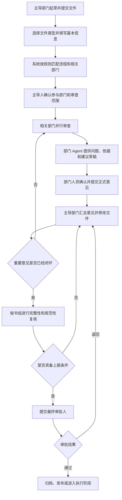
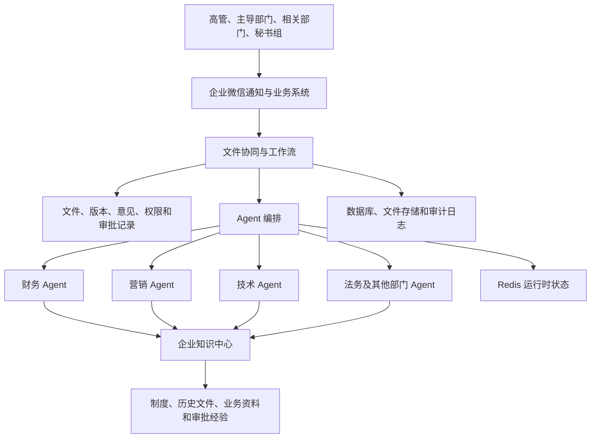

# 企业高管文件智能协同平台

## 业务理解与项目构想（讨论稿 V0.1）

**文档状态：** 内部讨论稿  
**编写日期：** 2026 年 7 月 13 日  
**当前阶段：** 业务理解与方向讨论，尚未进入正式需求和技术设计阶段

---

## 1. 为什么写这份文档

这份文档是我根据目前了解到的情况，对项目背景、实际业务、可能的产品形态以及建设边界做的一次整理。

它不是最终需求，也不是已经确定的技术方案。里面有些内容是目前已经了解的事实，有些是基于现状作出的判断，还有一些问题需要继续和 CTO、业务负责人以及实际参与文件流转的人确认。

现阶段先把“我们到底想解决什么问题”说清楚，比马上讨论用什么模型、什么框架更重要。后续讨论中如果发现理解有偏差，就直接修改这份文档，逐步形成大家认可的版本，再据此确定 Demo 和正式建设方案。

## 2. 我对这个项目的总体理解

公司高管之间有一类重要文件，需要多个部门参与讨论、修改和审批。现在主要通过邮件完成流转：主导部门发出文件，相关部门分别提出意见，主导部门修改后再次发送，经过几轮往返，再交给秘书组审查，最后提交老板审批。

这套方式能够运行，但随着文件数量、参与部门和往返轮次增加，容易出现版本混乱、意见分散、进度不清楚、历史经验无法复用等问题。很多工作依赖参与人的经验和责任心，过程本身缺少一个统一的载体。

这个项目想做的，不只是把邮件审批搬到网页上，也不是给每个人增加一个聊天机器人。更接近的方向是：

> 建立一个以文件为中心的协同平台，把原来的文件流转、部门审查、修改反馈、秘书组复核和最终审批放到同一条流程中；同时为各部门提供能够结合公司制度和历史资料进行分析的专业助手。

系统负责把流程和信息组织好，Agent 帮助人发现问题、查找依据、整理意见，人仍然负责正式判断和最终决策。

## 3. 目前的业务是怎样运行的

以技术部发起一份规划文件为例：

1. 技术部是这份文件的主导部门，负责起草、发起、解释和后续修改。
2. 文件可能影响营销、财务、法务或其他部门，这些部门需要从自己的职责出发参与审查。
3. 各部门阅读文件后，分别提出缺失内容、风险、疑问和修改建议。
4. 技术部汇总意见，修改文件，并根据情况再次发给相关部门确认。
5. 文件可能需要往返多轮，直到主要问题得到处理。
6. 文件进入秘书组，由秘书组检查格式、完整性、意见闭环情况以及是否具备上报条件。
7. 秘书组通过后，提交老板进行最终审批；也可能在中间某个环节被退回。
8. 审批完成后，文件进入发布、执行或归档阶段。

这里最重要的一点是：同一个部门在不同文件中的角色并不固定。技术部在技术规划中可能是主导方，在财务制度或营销方案中也可能只是被征求意见的一方。

项目当前沿用公司内部的 RAIC 叫法。每个字母对应的正式职责、权限和责任边界，还需要结合公司的实际定义补充，不能只按通用概念直接套用。

## 4. 现在这种方式主要有哪些问题

### 4.1 文件版本容易混乱

邮件附件在多个部门之间反复发送后，很容易同时存在多个版本。参与人可能在旧版本上继续修改，也可能不清楚某条意见是否已经处理。

### 4.2 意见散落在不同地方

有些意见在邮件正文里，有些在附件批注里，有些来自口头沟通或聊天记录。主导部门需要人工汇总，秘书组和老板也很难快速了解完整过程。

### 4.3 流转状态不够透明

文件当前在谁手里、哪些部门已经回复、哪些问题还没有解决、是否已经超时，通常需要人工询问和催办。

### 4.4 审查质量依赖个人经验

同一类文件由不同人审查，关注点可能差别很大。经验丰富的人知道该看什么，新参与者则可能遗漏重要问题。部门内部已经形成的审查经验，没有稳定地沉淀下来。

### 4.5 意见和依据没有稳定关联

部门提出意见时，背后往往有公司制度、管理办法、历史文件或业务数据作为依据。但在现有沟通中，这些依据不一定会被明确标注，后来的人也不容易追溯。

### 4.6 管理者接收到的信息过于庞杂

到了最终审批阶段，老板真正需要的是文件核心内容、关键变化、各部门结论、未解决的分歧和需要决策的事项，而不是从头翻阅所有往返邮件。

### 4.7 过去的处理经验难以复用

相似文件过去是怎么审的、出现过哪些问题、最后为什么这样决定，往往留在邮件和个人记忆中。下一次遇到相似情况时，很多工作需要重新做一遍。

## 5. 这个项目希望解决什么

我理解的项目目标主要有六个：

1. **把文件流转过程统一起来。** 每份文件从发起到最终审批，都有明确的节点、参与人、状态和处理记录。
2. **把文件版本管清楚。** 系统能够说明当前正式版本是什么、每一版改了什么、为什么修改。
3. **把部门意见组织起来。** 每条意见都有提出人、责任部门、处理状态和对应的文件位置。
4. **帮助各部门提高审查质量。** 部门 Agent 按专业检查项阅读文件，提示可能遗漏的内容，并给出可参考的依据。
5. **让意见能够追溯。** Agent 或人工提出的重要意见，可以关联到具体制度、历史文件、章节或数据来源。
6. **让管理者更容易做决定。** 系统在最终审批前提供简明摘要，说明关键问题、修改过程、部门结论和未解决事项。

如果只做到线上审批，这个项目的价值有限；如果只做到 AI 审查，又无法解决真实的文件流转问题。两部分需要结合起来，但各自的边界必须清楚。

## 6. 这不应该被做成什么

为了避免项目方向越走越偏，目前需要先明确几个边界：

- 它不是一个普通的知识库问答系统。
- 它不是让多个 Agent 自由聊天、最后自动替公司作决定。
- 它不是简单复制现有邮件页面，再增加一个“AI 总结”按钮。
- 它不是第一版就覆盖公司所有文件和所有审批场景的大平台。
- 它不能让大模型绕过公司的正式权限和责任体系。

Agent 可以提出建议、发现风险、补充依据和整理分歧，但不能因为“模型认为应该通过”就自动完成正式审批。

## 7. 主要参与者及其职责

### 7.1 文件主导部门（A）

主导部门负责发起文件、说明目的、选择或确认参与部门、回应意见、修改正文，并推动文件最终形成一致意见。无论 Agent 提供多少辅助，文件质量和正式提交责任仍然属于主导部门。

### 7.2 相关审查部门（C）

相关部门从本部门职责出发进行审查。例如：

- 财务部门关注预算、资金来源、投入产出和财务风险；
- 法务部门关注合法合规、责任边界和合同风险；
- 营销部门关注市场、客户、品牌和渠道影响；
- 技术部门关注可行性、系统影响、安全和实施成本；
- 人力部门关注组织、岗位、人员和绩效影响。

相关部门不只是选择“同意”或“不同意”，还需要说明问题是什么、为什么是问题、可能造成什么影响、建议如何处理。

### 7.3 秘书组

秘书组更像最终上报前的质量关口，主要检查文件是否完整、格式是否规范、各部门意见是否得到处理、是否仍存在重要分歧，以及是否具备提交老板审批的条件。

### 7.4 最终审批人

最终审批人需要看到经过整理的信息，包括文件要点、主要修改、各部门结论、尚未解决的问题和需要作出的决定。最终是否通过、退回或附条件通过，由有权限的人决定。

### 7.5 部门 Agent

部门 Agent 是专业助手，不是审批责任人。它可以帮助本部门阅读文件、执行检查清单、查找相关制度、提示遗漏、形成意见草稿，但正式意见应由部门人员确认后提交。

### 7.6 平台及知识维护人员

这类人员负责维护组织、权限、文件类型、流程规则、知识来源和有效版本。知识库如果长期无人维护，Agent 的意见会逐渐失去可信度。

## 8. 我理解的完整业务流程

这条流程中的“系统匹配”不等于让 AI 自己决定一切。第一阶段可以先用确定的业务规则匹配，再由 Agent 提示可能遗漏的参与部门，最后让主导人确认。这样既能提高效率，也不会破坏责任边界。

## 9. 不同文件类型为什么要区别处理

不同文件关注的问题不同，参与部门、审查重点、流程节点和最终产物也可能不同，不能用一套固定模板处理所有文件。

| 文件类型 | 可能关注的内容 | 可能参与的部门 | 当前理解 |
| --- | --- | --- | --- |
| 规划类文件 | 目标、资源、预算、里程碑、风险、部门影响 | 业务、财务、技术、人力等 | 更强调可行性和资源协调 |
| 流程类文件 | 角色、步骤、输入输出、控制点、异常处理 | 流程涉及部门、法务、审计、技术等 | 更强调职责清晰和可执行性 |
| 制度类文件 | 适用范围、权责、处罚、例外、与现有制度的冲突 | 法务、人力、财务及相关业务部门 | 更强调合规、一致性和正式发布 |
| 决策或请示类文件 | 事项背景、可选方案、成本收益、风险和决策点 | 与事项直接相关的部门 | 更强调信息完整和决策依据 |

上表只是初步分类。公司实际有哪些正式文件类型、每种文件对应哪些规则，需要继续确认。Demo 阶段最好只选择其中一种做深做完整。

## 10. 部门 Agent 应该怎样工作

每个部门需要有自己的专业 Agent，而不是所有人共用一个只更换角色名称的通用助手。

部门 Agent 的稳定能力至少包括：

- 本部门的审查标准和检查清单；
- 可以访问的知识范围；
- 常见风险和历史处理经验；
- 必须询问或必须核对的事项；
- 统一的意见表达方式；
- 明确的不确定性和人工确认要求。

同一个部门 Agent 在不同文件中承担的任务也会变化。例如，财务 Agent 审查规划文件时重点看预算和资源，审查流程文件时则更关注付款权限、财务控制点和审计记录。

Agent 给出的结果不应该是一大段泛泛而谈的文字，最好按照下面的方式组织：

1. **结论：** 当前是否存在需要处理的问题。
2. **问题：** 具体是哪一段或哪一个事项存在问题。
3. **依据：** 来自哪份制度、历史文件、数据或明确规则。
4. **影响：** 如果不处理，可能带来什么后果。
5. **建议：** 建议补充、修改、删除或进一步确认什么。
6. **确定程度：** 哪些是明确要求，哪些只是风险提示，哪些需要人工判断。

正式提交前，部门人员应当能够修改、接受或不采纳 Agent 的建议，并说明处理结果。

## 11. 工作流和 Agent 是什么关系

工作流与 Agent 解决的是两类不同问题。

工作流负责确定性的事情，例如文件当前处于哪个节点、谁有处理权限、什么时候超时、是否允许退回、哪个版本是正式版本。Agent 负责需要理解和分析的事情，例如文件可能影响哪些部门、内容是否存在遗漏、制度之间是否冲突、多个部门的意见是否重复。

可以简单概括为：

> 工作流管“谁在什么时候做什么”，Agent 帮助完成“这个节点应该看什么、怎么分析”。

涉及权责、权限和正式状态变化的动作，应由流程规则和有权限的人控制。Agent 可以建议下一步，但不能直接改变正式流程。

## 12. 企业知识库和 RAG 的作用

Agent 的意见不能只依赖模型自己的常识。真正有价值的意见，应该能够引用公司的原始资料。

知识范围可能包括：

- 本次流转的文件和附件；
- 公司制度、管理办法和部门规范；
- 历史规划、流程和审批文件；
- 历史审批意见及最终处理结果；
- 经过授权的业务、经营和财务资料；
- 外部法律法规和行业标准。

文件进入知识库后，需要经过解析、OCR、结构识别、内容切分、标签和权限处理，再建立关键词和语义检索。RAG 是 Agent 查找这些内容、把相关原文带入本次分析的方式，并不是知识库本身。

每段知识最好保留来源文件、版本、页码、章节、所属部门、生效时间、密级和访问权限。用户看到 Agent 意见时，应当能够点开原始依据，而不是只看到一句“根据公司规定”。

过期制度、重复文件和错误解析会直接影响结果，因此知识库建设不仅是导入文件，还包括持续维护和版本治理。

## 13. 动态提示词、Redis 和知识片段怎样配合

Agent 每次执行的任务不完全相同，所以提示词不能长期写成一段固定的大文本。系统需要根据当前任务动态组合信息，大致包括：

- 当前文件类型和审查规则；
- 当前部门及其专业职责；
- 当前部门在本文件中的 RAIC 角色；
- 当前流程节点和本轮目标；
- 文件正文、附件和版本变化；
- 前面各轮的意见及处理情况；
- 从知识库检索出的相关原文；
- 用户本轮补充的要求；
- 统一的输出格式和安全限制。

Redis 可以保存流程执行期间的短期状态，例如当前任务、最近几轮交互、Agent 执行进度、企业微信消息关联、并行任务完成情况、锁和重试状态。

Redis 不适合承担正式档案。文件版本、审批意见、流程状态、知识引用和操作日志应持久化到数据库或专门的文件存储中，确保服务重启或缓存丢失后仍然能够恢复和审计。

为了让不同系统之间能够准确关联，后续设计时至少需要统一文件、流程实例、文件版本、任务、部门 Agent、会话和企业微信消息等标识。

## 14. 企业微信在项目中的定位

企业微信适合作为日常通知和参与流程的入口，例如：

- 新文件或新任务提醒；
- 待办、催办和超时通知；
- Agent 完成审查后的提醒；
- 展示关键问题和意见摘要；
- 点击消息进入系统查看完整文件；
- 在权限允许时进行确认、退回或补充意见等轻量操作。

群机器人 Webhook 更适合单向发送消息。如果希望用户在企业微信中点击按钮后直接改变流程状态，还需要自建应用、用户身份认证和消息回调。

第一版没有必要把所有文件阅读、修改和复杂审批都放进企业微信。更稳妥的方式是让企业微信负责提醒和入口，完整处理仍在业务系统中完成。

## 15. 文件版本、意见闭环和审计留痕

这个项目是否真正好用，很大程度上取决于三个基础能力。

### 15.1 文件版本

系统需要明确当前版本、历史版本、版本提交人和提交时间，并能够展示两版之间的主要变化。用户不能在不知道版本的情况下继续审批。

### 15.2 意见闭环

每条意见应有清晰状态，例如待处理、已接受、已修改、暂不采纳、需要进一步讨论。主导部门需要说明处理结果，提出意见的部门可以根据规则确认是否已经解决。

### 15.3 操作留痕

提交、修改、查看、评论、退回、审批、知识引用和 Agent 执行都要留下记录。涉及正式决策时，还需要区分“Agent 建议”“个人草稿”和“部门正式意见”。

## 16. 权限和数据安全

高管文件通常具有一定敏感性。权限不能只控制“能不能登录”，还要控制用户可以看到哪些文件、哪些附件、哪些部门意见、哪些历史版本以及哪些知识来源。

Agent 检索知识库时也必须经过同样的权限过滤。用户没有权限查看的材料，不能因为 Agent 检索到了就出现在答案中。

后续至少需要考虑：

- 组织和人员身份从哪里同步；
- 文件密级和可见范围如何定义；
- 跨部门意见在什么阶段可见；
- 敏感内容能否发送给外部模型；
- 数据保存期限和删除规则；
- 下载、导出和转发是否需要控制；
- 所有重要操作是否可以审计。

这些问题会影响部署方式和模型选择，需要在正式技术设计前确认。

## 17. AI 在这个项目中的边界

为了让系统可控，至少应遵守以下原则：

1. Agent 不能代替有权限的人完成正式审批。
2. Agent 不能引用不存在的制度或编造依据。
3. 找不到可靠依据时，应当明确说明，而不是勉强给出结论。
4. Agent 只能访问当前用户和当前任务有权限使用的数据。
5. Agent 的建议必须允许人工修改、拒绝和补充。
6. 正式意见和最终决策必须能追溯到具体人员。
7. 重要流程状态不能只保存在模型对话或缓存中。
8. 流程、知识和提示词发生变化时，应保留版本记录。

系统追求的不是让 AI 表现得像最终决策者，而是让参与人更快、更完整地获得做决定所需的信息。

## 18. 整体能力关系

从这个关系看，项目可以概括为：工作流负责组织协作，部门 Agent 提供专业辅助，知识中心提供依据，企业微信提供日常入口，数据库和审计体系保证正式记录可靠保存。

## 19. Demo 应该验证什么

Demo 的目的不是把所有设想都做一遍，而是验证最关键的一条业务链能不能成立。

建议第一版只选一种文件类型、一个主导部门、两个相关审查部门、秘书组和最终审批人，完成下面的闭环：

1. 主导部门上传真实或脱敏后的样例文件。
2. 系统创建流程并通知相关参与者。
3. 两个部门 Agent 分别从自己的专业角度审查。
4. Agent 从一小批已经整理好的知识文件中找到依据。
5. 部门人员确认、修改并提交正式意见。
6. 主导部门处理意见并上传新版本。
7. 系统展示版本变化和意见处理状态。
8. 秘书组复核后提交最终审批。
9. 最终审批人看到文件摘要、关键变化、部门结论和未解决问题。
10. 全过程能够回看和追溯。

Demo 暂时不需要覆盖全部文件类型，也不需要让 Agent 自动批准、自由改变流程或长时间自主讨论。只要这一个闭环真实、清楚、可操作，就足以判断方向是否值得继续投入。

## 20. 怎样判断 Demo 是成功的

Demo 成功不应该只看模型回答是否“像那么回事”，还应至少满足以下条件：

- 一份文件能够完整走完发起、审查、修改、复核和审批；
- 不同部门 Agent 能给出明显不同且符合职责的审查意见；
- 重要意见能够打开并查看原始依据；
- 人可以修改或拒绝 Agent 意见，系统不会把建议当成正式结论；
- 文件版本和每条意见的处理结果清楚可见；
- 不同角色只能看到自己有权限查看的内容；
- 服务发生重启后，正式流程和审批记录不会丢失；
- 业务人员体验后，能够明确判断它比邮件方式好在哪里、哪里仍然不好用。

## 21. 目前看到的主要风险

### 21.1 业务规则没有完全说清楚

很多真实规则可能存在于习惯和口头约定中。如果不先梳理，系统容易把流程做得过于理想化。

### 21.2 第一版范围过大

如果一开始同时做所有文件类型、所有部门、企业微信深度交互和多个复杂 Agent，项目很容易长期停留在基础建设阶段，看不到实际结果。

### 21.3 知识材料质量不足

制度版本混乱、扫描件无法解析、权限信息缺失，都会让 Agent 的意见失去可信度。知识整理需要业务部门参与，不能完全由技术人员代替。

### 21.4 对 Agent 准确性的预期过高

Agent 擅长辅助阅读、查找和整理，但无法保证每次判断都正确。项目需要把人工确认和失败处理设计进去，而不是把它们当成特殊情况。

### 21.5 权限和外部模型使用限制

如果文件敏感，能否调用外部模型、哪些内容可以离开公司环境，会直接影响架构、成本和效果。

### 21.6 使用习惯改变

参与人已经习惯邮件。如果新系统增加了操作负担，却没有明显减少整理、催办和阅读时间，就很难真正推广。

## 22. 需要继续确认的问题

下面这些问题目前还不能替业务作决定，建议在下一轮讨论中逐项确认：

1. 公司对 RAIC 各角色的正式定义是什么，除了 A 和 C 之外，R、I 在流程中如何体现？
2. 现阶段最常见、最值得优先解决的文件类型是哪一种？
3. 不同文件类型现在是否已经有明确的流转规则和审查清单？
4. 相关审查部门由谁确定，是固定配置、主导人选择，还是系统推荐后人工确认？
5. 部门正式意见由个人提交还是必须由部门负责人确认？
6. 多个部门意见冲突时，现在由谁协调和裁决？
7. 秘书组的检查标准是否已有书面规则？
8. 最终审批有哪些结果，例如通过、退回、附条件通过或转其他会议决定？
9. 正式文件、附件和审批记录目前保存在哪里？
10. 企业微信第一阶段只做通知，还是需要直接完成审批操作？
11. 哪些文件可以交给外部大模型处理，哪些必须在公司内部运行？
12. 是否已经有可用于 Demo 的脱敏文件、制度依据和历史审批意见？
13. Demo 最希望向 CTO 和业务人员证明哪一项价值：提高审查质量、缩短流转时间、减少版本混乱，还是沉淀组织经验？

## 23. 建议的下一步

当前不建议直接进入编码。更合适的顺序是：

1. 由 CTO 和熟悉现有流程的人审阅这份文档，指出理解错误和遗漏。
2. 选择一种典型文件，按真实情况还原一次从发起到审批的过程。
3. 把参与角色、每个节点的输入输出、退回条件和审批规则补充清楚。
4. 确定 Demo 要验证的核心价值和验收标准。
5. 再根据确认后的业务流程，编写正式需求范围和技术方案。

项目目前最需要的不是把所有技术名词都定下来，而是先形成一张各方都认可的业务地图。只要业务边界清楚，工作流、Agent、知识库和企业微信分别该做什么，就会比较容易确定。

---

## 修订记录

| 版本 | 日期 | 说明 |
| --- | --- | --- |
| V0.1 | 2026-07-13 | 根据当前讨论整理第一版业务理解和项目构想，供 CTO 及相关人员评审 |
