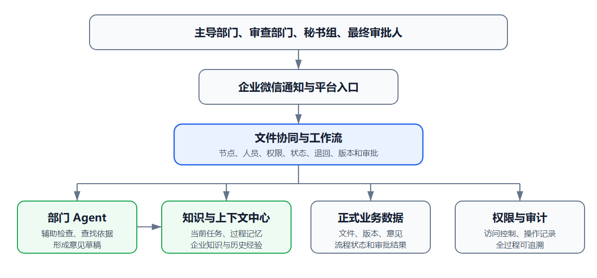
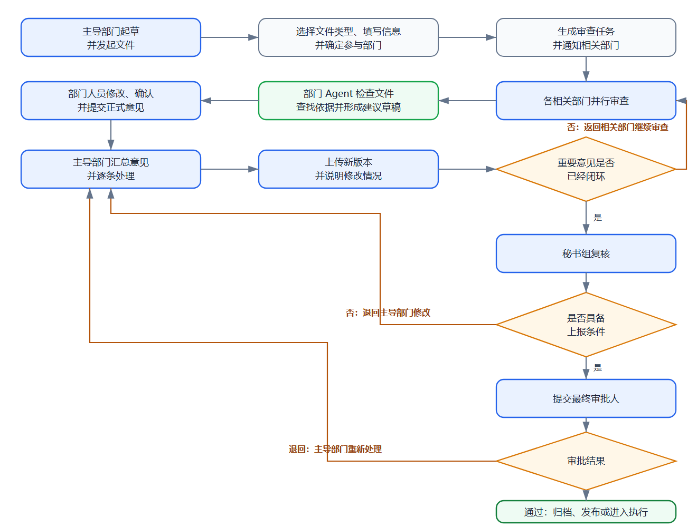

# 企业高管文件智能协同平台

## 业务理解与项目构想 V0.3

> 这是一份内部讨论稿，先把我们准备做的东西和目前理解的业务流程写清楚。文中没有确认的地方都放在最后，暂时不作为正式需求。

---

## 1. 我们准备做什么

我们准备做一套以文件为中心的协同平台，用来处理公司内部比较重要的文件。文件由主导部门发起，相关部门参与审查，经过意见反馈和多轮修改后，交给秘书组复核，最后由老板审批。

现在这套工作主要通过邮件完成。邮件能把文件发出去，但版本、意见和处理过程比较分散。时间一长，很难马上说清楚大家看的是哪一版、某条意见有没有改、为什么退回来，以及最后是根据什么作出的决定。

平台要做的，就是把这些事情放回到同一个文件任务里。打开一份文件，应该能看到当前版本、参与部门、处理进度、各部门意见、主导部门的回应和最后的审批结果。

部门 Agent 也放在这个过程中使用。它可以帮助阅读文件、检查遗漏、查找相关资料和整理意见草稿，但部门的正式意见仍然由部门人员确认，审批也仍然由人完成。

## 2. 这个平台大致包含什么

### 2.1 文件任务和版本

每次发起都形成一个文件任务。一份文件从开始流转到最后归档，都放在这个任务下面，中间上传的新版本、部门意见和退回记录不会散开。

文件以 Word 和 PDF 为主，也可能有 Excel。平台提供预览、下载和历史版本查看。需要修改正文时，主导部门下载文件，在本地改完后再上传新版本，暂时不考虑在平台里直接编辑或批注正文。

### 2.2 流程和意见

流程负责把文件送到该处理的人手里，并记录现在走到哪一步。相关部门可以同时审查；意见需要返回修改时，再回到主导部门处理；部门确认后，才能继续往下走。

意见要单独记录，不能只靠邮件正文或另外上传一张汇总表。至少要知道是谁提的、针对哪一版、主导部门怎么处理，以及最后有没有解决。

### 2.3 部门 Agent

不同部门看文件的角度不一样。财务关注预算和资金，法务关注合规和责任边界，技术部门关注可行性、系统影响和数据安全。部门 Agent 需要按照这些职责帮助检查，而不是所有部门共用一套泛泛的回答。

Agent 给出的内容先作为建议。部门人员看过以后，可以采用、修改、补充，也可以不用。人工确认后的内容才算部门正式意见。

### 2.4 知识和上下文

Agent 审查文件时，光有一个知识库还不够。它还要知道当前处理的是哪份文件、哪一个版本、现在处于什么环节、代表哪个部门、前几轮提过什么意见，以及这些意见后来怎么处理了。

公司制度、历史文件、审批经验和业务资料是可以长期使用的知识；当前文件、流程和意见记录是这次任务的背景。两部分合在一起，才是 Agent 真正需要的上下文。知识库可以理解为上下文中长期保存、以后还会反复使用的那一部分。

### 2.5 通知和管理

企业微信主要用来通知和提醒，比如收到新的审查任务、任务快到期、文件被退回或者审批已经完成。收到消息后，用户进入平台处理，正式记录仍然留在平台中。

另外还需要有管理功能，用来维护人员、部门、文件类型、参与规则、部门检查重点和知识资料。这些管理权限和查看业务文件的权限要分开，不能因为负责维护平台就默认能看到所有文件。

## 3. 谁参与

| 参与方 | 主要工作 |
| --- | --- |
| 文件主导部门 | 起草和发起文件，确定参与范围，回应意见，修改文件并推动流程完成 |
| 相关审查部门 | 从本部门职责出发审查文件，提交正式意见，必要时确认修改结果 |
| 秘书组 | 检查文件是否完整、格式是否符合要求、参与部门是否齐全、重要意见是否已经处理 |
| 最终审批人 | 查看文件、部门意见和没有解决的问题，作出最终决定 |
| 部门 Agent | 辅助本部门阅读、检查、查找依据和起草意见，不承担正式责任 |
| 平台维护人员 | 维护人员、权限、文件类型、流程规则、部门检查重点和知识资料 |

目前我们只比较明确地知道，文件主导部门承担 A 的职责，相关专业部门或受影响部门承担 C 的职责。RAIC 中 R、A、I、C 的正式定义还没有确认，所以文档里先按实际工作来描述，不替公司提前下定义。

同一个人在不同文件里也可能承担不同角色。后续权限和待办应该以这个人在当前文件中的职责为准，而不是只看他的固定职务。

## 4. 文件怎么流转

### 4.1 发起

主导部门上传文件，说明这份文件要解决什么问题、希望大家重点看什么、什么时候需要完成，并选择参加审查的部门。

不同类型的文件，参与部门和检查重点可能不同。平台可以根据已有规则给出建议，但最后还是由有权限的人确认。正式发起后形成第一版文件，相关部门同时收到待办。

### 4.2 部门审查

参与部门打开任务后，先看到当前版本、文件背景、本部门需要关注的内容和截止时间。部门 Agent 可以先给出检查结果和意见草稿，部门人员再根据实际情况作出判断。

部门提交意见时，需要说清楚具体问题、理由和建议。如果认为修改后还要再看一次，也要在提交时说明。没有意见的部门同样需要明确确认，不能因为一直没有回复就默认没有意见。

### 4.3 主导部门处理意见

各部门提交后，主导部门逐条处理。接受的意见说明准备怎么改；不采纳或只采纳一部分的，要写明原因；需要继续讨论的，也要保留在任务中。

文件正文有变化时，主导部门上传新版本，并简单说明这一版主要改了什么、处理了哪些意见。旧版本继续保留，不能被新文件覆盖。

### 4.4 再次确认

有些意见由主导部门回应以后就可以结束，有些则需要返回提出意见的部门确认。提出部门看过新版本和处理说明后，可以确认已经解决，也可以继续提出问题。

如果双方确实无法达成一致，不必为了让流程继续而把意见写成“已解决”。分歧可以保留下来，交给秘书组协调，或者在最终审批时说明清楚。哪些意见必须由原部门确认、哪些分歧可以继续上报，目前还需要业务上再定。

### 4.5 秘书组复核

部门审查和意见处理达到要求后，主导部门提交秘书组。秘书组主要看文件和附件是否齐全、当前版本是否正确、该参加的部门是否都参加了、重要意见有没有回应，以及还有没有需要向审批人单独说明的事情。

不具备上报条件时，秘书组退回主导部门，并写明原因。主导部门修改后重新提交，上一轮复核记录仍然保留。

### 4.6 最终审批和归档

审批人除了查看当前文件，还应该能看到文件摘要、各部门的结论、主要修改、重要意见的处理结果和仍然存在的分歧。这样不用重新翻完整个过程，也能知道真正需要决定的是什么。

审批通过后，当前正式文件、历史版本、部门意见、处理说明、复核记录和审批结果一起归档。以后处理同类文件时，在权限允许的情况下，可以参考这次的文件和处理经验。

如果审批退回，需要写明退回原因，以及回到哪个环节。不能每次都简单地回到最开始，让没有受到影响的部门全部重新做一遍。

## 5. 意见和版本怎么管

版本和意见是这套业务里最容易乱的两块，需要单独说明。

### 5.1 文件版本

一份任务在任何时候都要有明确的当前版本。每次修改后上传新文件，形成一个新版本，旧版本继续保留。每一版由谁上传、什么时候上传、主要改了什么，都需要有记录。

部门意见要和当时审查的版本对应起来。如果部门还在看旧版本，主导部门又上传了新版本，平台要提醒审查人员，避免大家在不同版本上继续讨论。

修改范围较小时，可以只请相关部门确认；如果改动影响了文件的主要内容，或者影响到新的部门，可能需要重新扩大审查范围。这个判断不能完全按“改了多少字”来定，还是要看业务影响。

### 5.2 部门意见

正式意见和普通讨论不一样。一条意见最好只讲一个问题，内容至少要包含问题、理由和建议。部门正式提交以后，不能直接删除；发现内容有误，可以撤回或补充说明，但原来的记录还要留着。

主导部门处理后，意见大体会出现几种结果：已经解决、等待原部门确认、暂时不采纳、需要继续讨论、保留分歧。具体名称以后可以按公司的使用习惯调整，没有必要现在就把状态定得很细。

这里最关键的不是状态有多少个，而是每条意见都能回头看清楚：谁提的、针对哪一版、怎么处理的、最后有没有形成一致意见。

## 6. Agent、知识库和上下文

部门 Agent 的定位要收住。它不是一个独立的审批角色，也不代表部门自动发表意见。它的作用是帮助参与人少漏看问题，更快找到依据，并把零散想法整理成可以修改的草稿。

比较适合的输出包括：发现的问题、问题在文件中的位置、相关依据、可能的影响和修改建议。部门人员看过以后再决定哪些内容需要进入正式意见。

Agent 每次处理文件时使用的背景，大致包括：

- 当前文件和版本；
- 文件类型、当前环节和本部门职责；
- 前几轮部门意见及处理结果；
- 仍然没有解决的问题；
- 与本次审查有关的制度、历史文件和业务资料；
- 用户这一次提出的具体要求。

这些内容不应该一次性全部塞进去，而是跟着当前任务来取。比如财务部门审查预算问题，不需要同时看到与它无关的其他部门资料；没有权限查看的文件，也不能因为使用 Agent 就能看到。

过程中的短期记忆只是为了让 Agent 能接着上一次的内容继续处理。正式文件、正式意见、版本和审批结果还是要作为业务记录保存，不能只留在 Agent 的对话里。

## 7. 实际使用中还会遇到的情况

主流程画出来并不复杂，真正使用时容易出问题的是中间这些情况：

| 情况 | 目前的处理理解 |
| --- | --- |
| 发起后发现少了参与部门 | 可以补充，但要记录由谁增加、为什么增加，以及新增部门从哪一版开始审查 |
| 审查人员请假或调岗 | 待办可以转给同部门其他人员，之前的处理记录不删除 |
| 部门无法按期完成 | 需要说明原因和新的时间，是否影响整体截止时间由有权限的人确认 |
| 审查过程中出现新版本 | 正在处理旧版本的人需要收到提醒，再决定是否按新版本重新检查 |
| 主导部门想撤回文件 | 需要说明原因，并区分是修改后重新提交，还是终止这次任务 |
| 部门之间长期无法一致 | 保留双方意见和依据，不强行闭环，交给后续环节处理 |
| 秘书组退回 | 写明具体问题，主导部门处理后重新提交，保留上一轮记录 |
| 审批人退回 | 说明退回到哪个环节、哪些部门需要重新参与，不默认全部重来 |
| 文件不再继续推进 | 由有权限的人终止，原因和已经产生的记录继续保留 |

这些做法目前只是根据现有流程形成的理解，具体由谁操作、哪些情况需要上级确认，还要结合公司的实际规则再定。

## 8. 权限和记录

文件能不能看，不能只按部门或职位简单判断，还要看这个人是否参与当前任务、在任务中承担什么职责，以及文件本身有没有范围限制。

意见的可见范围也需要单独确认。例如，部门在第一次提交前能不能看到其他部门的意见，审批人要不要看到 Agent 的原始建议，平台维护人员能不能接触业务文件，这些都会影响实际的协作方式。

发起、查看、下载、上传、提交意见、处理意见、退回、审批、人员转交和权限调整都要有记录。Agent 提供过什么建议、最后有没有被人工采用，也可以保留，但要和正式意见区分开。

## 9. 还需要确认的业务问题

下面这些问题会直接影响后面的产品范围和流程规则，现阶段不适合凭理解替业务下结论。

### 9.1 角色和参与范围

1. RAIC 中 R、A、I、C 的正式定义分别是什么？
2. 谁来确认一份文件应该有哪些部门参加？发起后能不能增加或减少？
3. I 只是收到通知，还是也要明确确认？
4. 同一个部门是否可能同时承担不同角色？

### 9.2 文件类型和流转规则

1. 现在实际有哪些主要文件类型？
2. 规划类、流程类、制度类文件的参与部门和检查重点分别是什么？
3. 是否所有文件都需要经过秘书组和老板，还是存在其他路径？
4. 是否会出现多个审批人、顺序审批或者共同审批？

### 9.3 意见和退回

1. 部门现在通常怎样提交正式意见，有没有固定格式？
2. 哪些意见必须返回原部门确认后才能算处理完成？
3. 有意见没有闭环时，什么情况下仍然可以继续上报？
4. 部门之间有分歧时，现在通常由谁协调、谁决定？
5. 秘书组和最终审批人分别可以把文件退回到哪些环节？

### 9.4 归档和知识使用

1. 审批通过后是否还要编号、发布、盖章或者交办？
2. 文件和完整过程记录需要保存多久？
3. 历史文件、制度和审批经验由谁维护，怎样判断已经失效？
4. 哪些资料可以给后续文件参考，哪些只能在原任务中查看？
5. 哪些部门最需要 Agent 帮助，各自最希望它检查什么？

---

目前先把主流程和几个关键关系理解到这个程度。下一步如果继续细化，应该先确认 RAIC、文件类型、意见闭环和退回规则，这几项会直接影响后面的产品设计。
