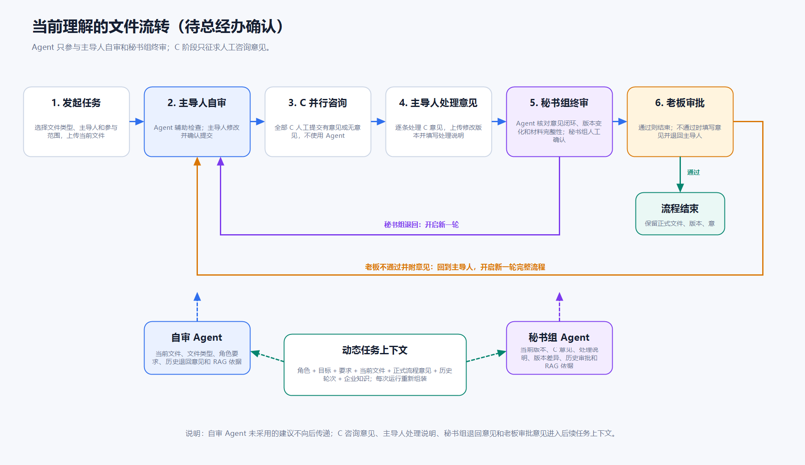

# 文件智能协同平台

## 业务理解与项目构想

---

> **文档用途：** 这份材料用于和总经办核对实际业务流程，不是最终需求或技术方案。

## 1. 我们要做什么

我们要做一套以文件为中心的协同平台，把文件发起、自审、征求意见、修改、秘书组终审和老板审批放到同一个流程中。

平台需要把每一版文件、每轮咨询意见、主导人的处理说明、秘书组意见和老板审批结果保存清楚。参与人进入系统后，应该能直接看到当前轮到谁、处理的是哪一版文件、前面有哪些意见以及这一步需要完成什么。

Agent 不会参与所有节点。目前只在两个地方使用：

- 文件主导人自审时，辅助检查当前文件；
- 秘书组终审时，辅助核对咨询意见、修改情况和历史审批记录。

C 咨询和老板审批都是人工处理，不由 Agent 代替。

## 2. 平台由哪些部分组成

### 2.1 文件协同和工作流

工作流负责组织任务、参与人、节点、待办、状态和循环。它需要支持：

- 发起文件任务并确定主导人和 C；
- 主导人自审；
- 向多个 C 并行征求意见；
- 等待意见收齐后交回主导人处理；
- 秘书组终审；
- 老板审批；
- 秘书组退回或老板不通过后开启新一轮；
- 全程记录文件版本、意见、处理人和操作时间。

流程向下传递前必须有人确认。Agent 可以提前生成分析结果，但不能自己提交文件、完成待办或改变正式流程状态。

目前了解到，公司可能已经有一套接入企业微信的工作流代码，用于流程通知和消息流转，但具体是什么系统、能否直接复用以及能够支持哪些流转规则还没有确认。现阶段先把它作为需要核实的现有条件，不直接认定必须新建工作流底座。

### 2.2 两类 Agent 辅助

当前不再按每个部门配置一个审查 Agent，而是先围绕两个明确节点建设能力。

**自审 Agent**站在文件主导人的角度，检查当前文件是否完整、是否符合文件类型和任务要求、是否存在明显遗漏或前后矛盾，并给出修改建议。

**秘书组 Agent**站在终审角度，除了检查当前文件，还要核对：

- C 咨询意见是否已经处理；
- 主导人的采纳或不采纳说明是否完整；
- 咨询版本和修改版本有哪些变化；
- 历次秘书组退回意见是否闭环；
- 历次老板不通过意见是否处理；
- 提交材料是否齐全；
- 是否还有需要秘书组或老板重点关注的风险。

两个 Agent 都只提供建议。自审结果由主导人确认，秘书组 Agent 结果由秘书组确认。

### 2.3 知识和任务上下文

Agent 每次运行时，需要知道当前处理的文件、所处节点和前面发生过什么。这里不能只按普通聊天记录来理解，更适合称为“任务上下文”。

任务上下文包括：

- 当前任务、文件类型和处理目标；
- 当前文件和指定版本；
- 当前用户在任务中的角色；
- C 咨询意见；
- 主导人的处理说明；
- 秘书组退回意见；
- 老板审批结果和不通过意见；
- 之前各轮的文件和处理记录；
- 与当前文件有关的制度、历史文件和业务知识。

知识库属于任务上下文的一部分，主要提供可长期复用的制度、业务资料和历史依据。当前文件、流程意见和审批记录来自正式业务数据，不应只保存在向量库或聊天记忆中。

每次 Agent 运行都重新组装上下文，不能把上一轮对话直接当成唯一依据。Agent 在分析前先明确角色、目标和检查要求，完成后再检查是否遗漏、重复、缺少依据或偏离目标。

### 2.4 企业微信入口

公司现有工作流可能已经接入企业微信，并负责待办通知和消息流转。后续优先复用现有能力，企业微信中的消息可以跳转到平台页面；正式文件查看、意见填写和审批仍然在平台页面中完成。

现有工作流是否同时提供组织同步、身份认证和单点登录还没有确认。通知接入和用户登录不能暂时视为同一件事，需要分别核实。

### 2.5 数据、权限和审计

正式文件、历史版本、C 咨询意见、主导人处理说明、秘书组意见和老板审批结果都要长期保存。

不同角色只能看到自己有权限访问的内容。例如：

- 自审 Agent 结果只给文件主导人看；
- 秘书组 Agent 结果先只给秘书组看，是否提供给老板仍待确认；
- 自审 Agent 未被主导人采用的建议不向后传递；
- 正式咨询意见、处理说明和审批意见会进入后续任务上下文。

文件查看、下载、上传、意见提交、退回、审批和 Agent 运行都需要记录操作人、时间和关联版本。

## 3. 谁参与这套流程

### 3.1 RACI 仍然是角色讨论的基础

目前仍按下面的基本概念理解 RACI：

| RACI 位置 | 基本含义 | 在流程中的作用 |
| --- | --- | --- |
| R：谁负责（Responsible） | 具体执行任务的人 | 准备文件、处理意见和推动任务 |
| A：谁批准（Accountable） | 对结果最终负责的人 | 确认结果并承担最终责任 |
| C：咨询谁（Consulted） | 需要征求意见的人 | 从专业职责或受影响角度提供咨询意见 |
| I：告知谁（Informed） | 需要知会的人 | 接收过程或结果信息，不直接处理任务 |

RACI 用来说明责任关系，不直接等于工作流权限。C 表示需要咨询，并不天然表示审批、通过、不通过或退回。

### 3.2 当前角色理解

| 角色 | 当前理解 | 还需确认 |
| --- | --- | --- |
| 文件主导人 | 发起任务、准备文件、完成自审、处理 C 意见并提交后续节点；当前理解可能同时承担 R 和 A | R、A 是否固定由同一人承担 |
| C | 对指定版本提供人工咨询意见，不使用 Agent，不承担正式审批 | C 的选择范围、意见提交要求和超时处理 |
| 秘书组 | 对处理后的文件进行终审，可以通过并提交老板，也可以退回主导人开启新一轮 | 终审具体检查标准 |
| 老板 | 对文件作最终审批，结果分为通过和不通过 | 不通过意见的必填范围和展示方式 |
| I | 接收过程或结果通知，不直接参与处理 | 哪些节点需要通知哪些人 |
| 平台维护人员 | 维护用户、部门、权限、流程配置、文件类型和知识资料 | 具体管理范围 |
| Agent | 只在自审和秘书组终审阶段提供分析建议，不属于正式 RACI 角色 | 秘书组 Agent 结果是否提供给老板 |

## 4. 当前理解的文件流程

### 4.1 发起任务

文件主导人发起任务，选择文件类型、参与范围和本次需要咨询的 C，并上传当前文件和相关材料。

任务建立后生成统一的 `task_id`。后续文件版本、咨询意见、Agent 运行、秘书组处理和老板审批都归到这个任务下。

### 4.2 主导人自审

进入自审节点后，系统自动运行一次自审 Agent。主导人可以查看建议、修改文件并重新分析，确认文件达到提交要求后，再发起 C 咨询。

自审 Agent 的结果只给主导人看。主导人没有采用的建议不会自动传给 C、秘书组或老板；只有正式文件、主导人确认采用的内容和后续正式流程记录会继续向下传递。

### 4.3 C 并行咨询

自审完成后，系统向本次确定的全部 C 并行发起咨询任务。C 阶段不使用 Agent，每位 C 直接查看同一个咨询版本并提交“有意见”或“无意见”。

C 的产出是咨询意见，不是审批结论，也不按“通过、不通过”处理。当前流程草案先按等待全部 C 提交后再继续理解，是否允许超时跳过、更换人员或提前结束，需要总经办确认。

C 咨询期间使用的文件版本需要固定，不能在有人已经开始查看后直接替换。如果主导人发现文件必须立即修改，需要怎样撤回本次咨询，也要单独确认。

### 4.4 主导人处理咨询意见

C 意见收齐后，工作流进入主导人的“意见处理和文件修订”节点，不把它表达成 C 退回。

主导人需要查看全部咨询意见，决定采纳或不采纳，必要时填写处理说明，修改文件并上传新版本。秘书组后续能够看到：

- C 咨询时查看的文件版本；
- 每条 C 意见；
- 主导人的采纳或不采纳说明；
- 修改后的文件版本；
- 两个版本之间的变化。

目前暂定修改后不要求所有 C 再次确认，主导人可以直接提交秘书组终审。确实需要再次征求意见时，由主导人重新发起 C 咨询。这个规则仍需总经办确认。

### 4.5 秘书组终审

进入秘书组终审节点后，系统自动运行秘书组 Agent。秘书组可以查看 Agent 分析、当前文件、C 意见、主导人处理说明、版本变化以及历次退回和审批记录。

秘书组人工确认后，可以：

- 通过并提交老板审批；
- 填写退回意见，直接退回文件主导人。

秘书组退回后，在原任务中开启新的 `review_round_id`。主导人上传新版本后，重新完整经过自审、全部 C 咨询、意见处理和秘书组终审。

秘书组 Agent 结果先只给秘书组看，是否随文件提供给老板暂时未定。

### 4.6 老板审批

老板审批阶段不使用 Agent。老板查看最终文件和平台允许展示的过程材料后，作出人工决定：

- **通过：** 流程结束；
- **不通过：** 填写审批意见并退回文件主导人。

老板不通过后，同样在原任务中开启新一轮。主导人修改文件后，重新完整经过自审、全部 C 咨询、意见处理、秘书组终审和老板审批。

### 4.7 轮次、版本和历史记录

老板或秘书组退回不会新建一个完全无关的任务，而是在同一个 `task_id` 下创建新的 `review_round_id`。

每一轮都要保存：

- 本轮开始时的文件版本；
- 自审 Agent 运行和主导人确认结果；
- C 咨询版本和全部意见；
- 主导人的处理说明及修改版本；
- 秘书组 Agent 运行和秘书组决定；
- 老板审批结果和意见。

这些内容既用于审计，也会成为后续 Agent 的任务上下文。

### 4.8 动态 Prompt 和上下文组装

自审 Agent 和秘书组 Agent 不使用一段固定不变的提示词。每次运行时，系统根据当前节点动态组装 Prompt，主要包括：

- 当前 Agent 的角色；
- 本次处理目标；
- 文件类型和检查要求；
- 当前文件和指定版本；
- 当前轮次及相关历史记录；
- 允许使用的正式流程意见；
- 从企业知识中检索到的依据；
- 输出格式和限制条件。

自审 Agent 更关注当前文件本身。秘书组 Agent 需要额外加入 C 意见、主导人处理说明、版本差异、秘书组历次退回意见和老板历次审批意见。

## 5. 当前可以先守住的原则

1. **业务流程和 Agent 分开。** 工作流管理正式任务和状态，Agent 只做分析。
2. **C 是咨询，不是审批。** C 提交人工咨询意见，不使用 Agent，也不把意见直接等同于退回。
3. **Agent 只进入两个节点。** 当前只在主导人自审和秘书组终审使用 Agent。
4. **正式决定由人作出。** Agent 不能提交正式意见、完成待办或推进流程。
5. **同一次 C 咨询使用同一版本。** 咨询开始后不能悄悄替换文件。
6. **咨询意见需要处理记录。** 主导人修改文件时，要保留意见、处理说明和版本变化。
7. **退回形成新轮次。** 秘书组退回或老板不通过后，保留历史并重新走完整流程。
8. **上下文从正式记录重新组装。** 不把普通聊天记忆当成唯一依据。
9. **未采用的自审建议不向后传递。** Agent 草稿和正式流程记录需要分开。
10. **权限贯穿全过程。** 页面、文件、意见、知识检索和 Agent 调用都要做权限校验。
11. **重要操作可追溯。** 文件、版本、意见、退回、审批和 Agent 运行都要留痕。
12. **正式数据长期保存。** 文件、历史版本、意见和审批记录不依赖 Agent 上下文保存。

## 6. 需要总经办确认的问题

下面的问题按沟通顺序分成两组。第一组决定主流程怎么走，建议优先确认；第二组是操作和例外情况，可以在主流程确定后继续补充。

### 6.1 先确认主流程

| 序号 | 需要确认的问题 | 当前暂定理解 |
| --- | --- | --- |
| 1 | 公司内部对 R、A、C、I 的正式定义是什么？文件主导人是否固定同时承担 R 和 A？ | 先按主导人同时承担 R/A、其他相关人员主要对应 C 理解 |
| 2 | 任务由谁发起？发起人和文件主导人是否一定是同一个人？文件主导人、文件类型和参与人分别由谁确定？ | 当前按文件主导人发起任务，并在发起时选择文件类型和 C |
| 3 | 每份文件的 C 怎样确定？是固定名单、按文件类型推荐，还是由主导人选择？ | 当前按主导人选择，系统可以根据文件类型提供建议 |
| 4 | 不同文件类型是否都使用当前这套主流程？哪些类型需要增加、减少或调整节点？ | 当前流程先作为文件协同的基础流程，具体差异待确认 |
| 5 | 主导人自审是否属于必须完成的正式节点？自审 Agent 给出建议后，主导人以什么操作表示自审完成并提交 C？ | 当前按正式节点处理，由主导人确认后向下提交 |
| 6 | C 是否只负责提供咨询意见，不作“通过、不通过、退回”决定？ | 当前按咨询角色理解，C 只提交“有意见”或“无意见” |
| 7 | 是否必须等待全部 C 明确提交意见后，才能交给主导人统一处理？ | 当前暂定必须全部提交，包括明确提交“无意见” |
| 8 | 主导人是否必须逐条处理 C 意见？采纳后如何说明，不采纳时是否必须填写原因？ | 当前倾向逐条处理，并保留采纳或不采纳说明 |
| 9 | 主导人修改并上传新版本后，默认直接提交秘书组，还是必须再次征求 C 意见？哪些情况需要重新咨询？ | 当前暂定默认提交秘书组；主导人认为有必要时，可以再发起一次 C 咨询 |
| 10 | 秘书组终审具体检查什么？哪些情况必须退回，哪些情况可以直接提交老板？ | 当前理解包括意见闭环、版本变化、材料完整性和风险检查 |
| 11 | 秘书组通过后，是由秘书组手动提交老板，还是系统自动进入老板审批？ | 当前倾向由秘书组人工确认并提交老板 |
| 12 | 秘书组退回或老板不通过后，是否都在原任务中开启新一轮，并重新完整经过自审、全部 C 咨询、秘书组终审和老板审批？ | 当前暂定两种退回都重新开始完整一轮 |
| 13 | 开启新一轮后，是否沿用上一轮全部 C？原有 C 是否必须再次明确提交“有意见”或“无意见”？ | 当前暂定全部 C 重新咨询，参与名单能否调整待确认 |
| 14 | 老板审批是否只有“通过”和“不通过”两种结果？选择不通过时，是否必须填写审批意见？ | 当前暂定只有两种结果，不通过时必须附带意见 |
| 15 | 老板通过代表流程结束，还是还需要发布、归档或其他确认？文件从哪个时间点正式生效？ | 当前暂定老板通过后流程结束，正式生效规则待确认 |

### 6.2 再确认操作和例外情况

| 序号 | 需要确认的问题 | 当前暂定理解 |
| --- | --- | --- |
| 1 | C 提交前能否查看其他 C 的意见？主导人是实时看到，还是收齐后统一看到？ | 待确认 |
| 2 | C 超时未提交时怎样处理？是否允许催办、延期、更换 C、跳过或由指定人员处理？ | 待确认 |
| 3 | C 咨询期间主导人发现文件错误，能否撤回文件、取消本次咨询或直接上传新版本？ | 待确认 |
| 4 | 流程进行中能否增加、移除或更换主导人和 C？调整后，已经提交的意见怎样处理？ | 待确认 |
| 5 | 一次提交的材料范围是什么？主文件、附件、补充说明是否需要组成固定材料包？ | 当前倾向按材料包统一管理和版本化 |
| 6 | 秘书组 Agent 的结果是否提供给老板？老板可以看到哪些过程材料和历史意见？ | 暂定 Agent 结果先只给秘书组看，老板的可见范围待确认 |
| 7 | 是否存在紧急流程、代办、转办或授权处理？这些操作由谁批准？ | 待确认 |
| 8 | 哪些节点需要通知 I？哪些人只接收结果通知，哪些人需要接收过程通知？ | 待确认 |

### 6.3 需要和内部技术人员确认的现有条件

| 序号 | 需要确认的问题 | 当前了解 |
| --- | --- | --- |
| 1 | 公司现有工作流是什么系统，由谁维护，能否取得源代码？ | 可能已有现成代码，具体情况待确认 |
| 2 | 现有工作流是否支持并行任务、全部 C 完成后汇总、退回和多轮循环？ | 待确认 |
| 3 | 现有系统能否提供启动流程、查询待办、完成任务、退回、撤回和查询历史的接口？ | 待确认 |
| 4 | 流程状态变化后，能否通过事件回调或消息方式通知文件协同平台？ | 待确认 |
| 5 | 现有工作流已经接入了哪些企业微信能力？通知、催办、待办和页面跳转分别怎样实现？ | 已知可能接入了通知和消息流转，细节待确认 |
| 6 | 用户、部门、企业微信身份和单点登录数据是否也由现有系统提供？ | 待确认，不能因为已有通知就默认已有登录和组织同步 |
| 7 | 现有流程配置能否扩展本项目的节点和规则，还是需要修改代码？ | 待确认 |
| 8 | 现有系统负责保存哪些数据？文件、意见和 Agent 结果是否仍由本平台独立保存？ | 当前倾向工作流只管流转，本平台保存正式业务数据 |

总经办和内部技术人员确认后的答案，需要分别回到正文、流程图和技术架构中。当前暂定理解只用于继续梳理方案，不作为最终业务规则或最终技术选型。
