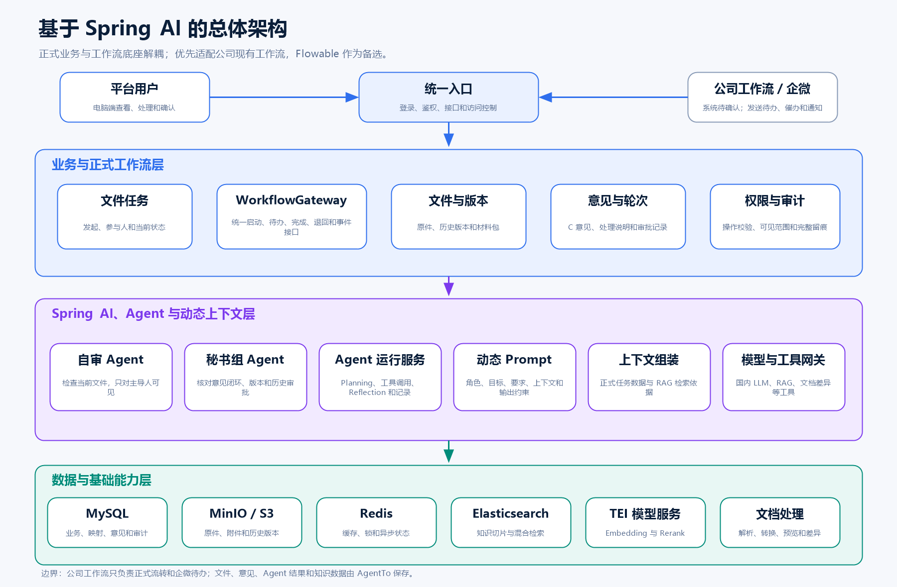
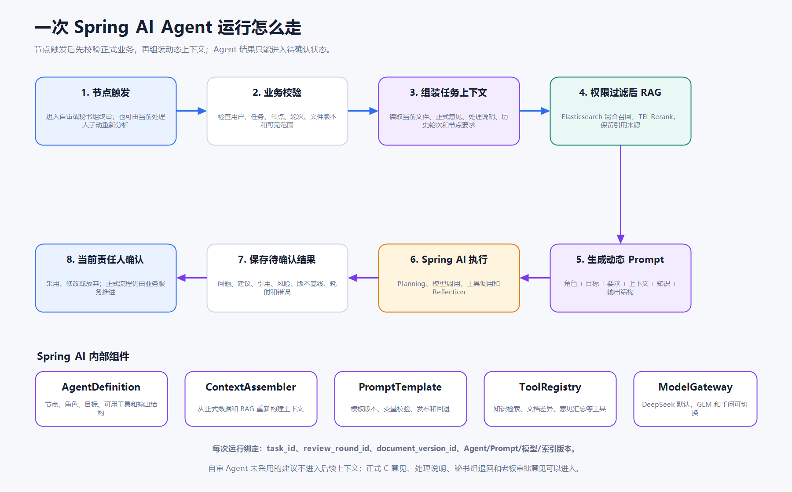
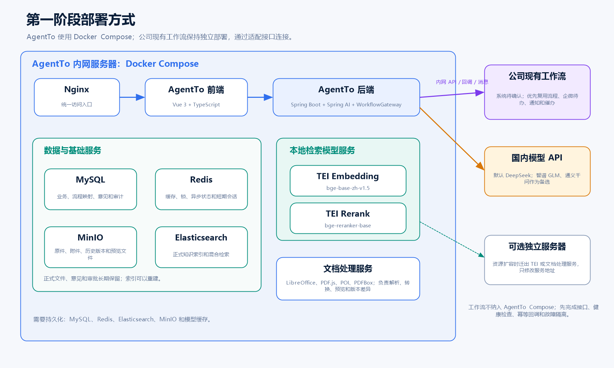

# 文件智能协同平台

## 技术架构与开发参考

---

> 这份文档是在当前业务理解基础上整理的技术方案。Agent 能力直接基于 Spring AI 建设，不再保留其他 AI 编排平台。公司可能已经有一套接入企业微信的工作流代码，但系统名称、技术实现和开放能力还没有确认。因此本文优先按“适配公司现有工作流”设计，Flowable 只作为现有系统不适用时的备选。

> 文档中的架构图和流程图均为 `docs/assets` 下的实际 PNG 文件，转发 Markdown 时需要把 `assets` 目录一并发送。

## 1. 目前的技术结论

这套系统仍然分成两条主线：

- Spring Boot 管理正式文件业务，通过统一的工作流适配层连接公司现有工作流；
- Spring AI 管理自审 Agent、秘书组 Agent、模型调用、工具调用、动态 Prompt 和 RAG。

当前技术组合确定为：

- 后端：Spring Boot；
- 正式工作流：优先复用公司现有工作流，具体系统待确认；Flowable 作为备选；
- Agent 框架：Spring AI；
- 业务和流程数据：MySQL；
- 文件和历史版本：MinIO 或兼容 S3 的对象存储；
- 缓存、锁和短期状态：Redis；
- 正式知识索引：Elasticsearch；
- Embedding 和 Rerank：BGE 模型，通过 TEI 独立提供 HTTP 服务；
- 对话和文件分析模型：默认 DeepSeek，智谱 GLM-5.2 和通义千问作为备选；
- 前端：Vue 3、TypeScript、Vite、Element Plus；
- 第一阶段部署：Docker Compose 内网一键启动。

业务规则可能继续调整，但下面三条边界不变：

1. Agent 只参与主导人自审和秘书组终审；
2. C 咨询和老板审批都是纯人工节点；
3. AI 输出必须经过当前责任人确认，不能直接推进正式流程。

## 2. 业务流程和技术实现的关系

当前业务流程草案如下图。图中的 C 意见处理、超时、重新咨询等细节仍需总经办确认，但不影响总体技术分层。


业务系统围绕 `task_id` 组织数据。每次秘书组退回或老板不通过时，在原任务下创建新的 `review_round_id`，不新建一套彼此无关的数据。

建议至少保留下面的标识关系：

- `task_id`：文件任务；
- `workflow_instance_id`：工作流实例在 AgentTo 中的统一标识；
- `external_workflow_instance_id`：公司现有工作流中的流程实例标识；
- `external_task_id`：公司现有工作流中的待办标识；
- `review_round_id`：某一轮完整处理；
- `document_id`：逻辑文件；
- `document_version_id`：具体文件版本；
- `consultation_package_id`：C 本次实际查看的主文件、附件和说明；
- `agent_run_id`：某一次 Agent 运行。

业务规则变化时，主要调整工作流定义、节点配置和业务规则；文件、版本、意见、上下文和 Agent 运行仍然通过这些标识关联。即使后续更换工作流底座，AgentTo 内部的任务和文件标识也不跟着变化。

## 3. 总体架构



第一阶段仍然采用模块化单体。平台只有少量高管和秘书组人员使用，主要开发也集中在一个人身上，没有必要一开始就拆成大量微服务。

模块化单体指的是一次部署，但代码内部按职责分开：

- 文件任务；
- 工作流；
- 文件与版本；
- C 咨询意见和处理说明；
- 轮次和审批；
- 权限与审计；
- Agent 运行；
- 动态上下文；
- 知识检索；
- 通知。

文档处理、TEI 模型服务等耗时或资源独立的部分，可以先使用独立容器，后续再迁到其他机器。

## 4. 正式业务和工作流适配

### 4.1 正式业务由 Spring Boot 统一处理

前端不能绕过 AgentTo 业务服务直接完成工作流待办。用户提交咨询意见、处理说明、秘书组决定或老板审批时，先调用业务服务：

1. 校验当前用户、任务角色、节点、轮次和文件版本；
2. 保存正式业务记录；
3. 写入审计日志；
4. 再通过 `WorkflowGateway` 完成对应的工作流待办。

这样可以避免流程已经推进，但意见或文件版本没有保存成功。

### 4.2 通过统一接口适配工作流

AgentTo 内部定义 `WorkflowGateway`，业务代码只依赖这套统一接口，不直接依赖公司现有工作流或 Flowable 的专用 API。第一阶段至少需要支持：

- 启动流程；
- 查询当前节点和待办；
- 完成人工任务；
- 退回、撤回和重新发起；
- 查询流程轨迹；
- 接收节点变化和待办变化事件；
- 传递企业微信通知所需的业务链接和摘要。

工作流系统主要管理：

- 人工任务和候选人；
- C 并行咨询；
- 等待全部 C 提交；
- 主导人意见处理；
- 秘书组终审；
- 老板审批；
- 退回、循环、催办和历史轨迹。

文件正文、大段意见、Agent 上下文和知识切片不放进工作流变量。工作流侧只保留 `task_id`、`review_round_id`、`document_version_id` 等标识和少量流转判断。正式文件、版本、意见和 Agent 结果仍由 AgentTo 保存。

公司现有工作流通过适配器接入；如果确认现有系统无法支持本项目，再实现 Flowable 适配器。两种实现对上层业务提供相同接口。

### 4.3 工作流细节保持可配置

当前还没有最终确认的内容包括 C 是否必须全部提交、C 超时如何处理、什么时候需要再次咨询、参与人能否中途调整等。

这些内容不写成散落在业务代码中的 `if/else`。工作流定义、节点配置和业务规则共同决定流转。是否直接使用公司现有工作流的配置页面，需要先确认它的扩展能力；如果现有页面不能满足要求，再由 AgentTo 提供受控的流程配置，而不是同时维护两套配置入口。

已有流程实例默认继续使用原流程版本，新任务使用新版本。需要迁移旧实例时，必须单独设计迁移和回退方案。

### 4.4 Agent 触发不阻塞人工处理

进入自审或秘书组终审节点后，业务系统创建一条 `AgentRunRequested` 异步任务。页面显示“分析中”，当前处理人不需要等待接口长时间阻塞。

Agent 运行成功后显示待确认结果；运行失败时显示失败原因并允许重新分析。AI 服务异常不能让正式工作流无法人工处理，也不能让企业微信待办失去正常流转能力。

## 5. 文件、版本和意见

文件原件保存在 MinIO，MySQL 保存文件元数据、对象地址、校验值、版本关系和权限信息。每次上传都生成新版本，不能覆盖旧对象。

C 咨询开始后，本次 `consultation_package_id` 对应的文件和附件需要冻结。C 提交意见后，主导人可以上传修改版本，但必须同时保留：

- C 实际咨询的版本；
- 修改后的版本；
- C 原始意见；
- 主导人的采纳或不采纳说明；
- 两个版本之间的变化。

秘书组 Agent 需要读取这些数据，才能判断意见是否闭环。

正式文件、历史版本和审计日志默认长期保留。平台可以提供受控删除入口，但第一阶段优先做逻辑删除或归档，删除需要权限、二次确认、原因和审计记录。

文件上传时计算哈希值并记录操作人和时间。第一阶段不接电子签名和数字签章。

## 6. 权限设计

权限分成三层：

1. **平台基础权限：** 控制发起任务、维护组织、配置流程、维护知识和查看审计等功能；
2. **任务操作权限：** 根据当前任务中的主导人、C、秘书组和老板身份，以及当前节点，判断能执行什么操作；
3. **数据范围权限：** 判断能查看哪一版文件、哪些附件、哪些意见、哪些 Agent 结果和哪些知识资料。

后端按“用户、任务、对象、动作”统一校验。页面隐藏按钮只是交互处理，不能代替接口权限。

Agent 调用前同样执行权限校验。自审 Agent 结果只给主导人看；秘书组 Agent 结果先只给秘书组看；是否提供给老板由后续业务规则决定。

## 7. Spring AI Agent 设计

### 7.1 两个 Agent 共用一套运行框架

自审 Agent 和秘书组 Agent 不是两套独立系统。它们共用模型网关、上下文组装、Prompt 管理、工具注册、运行记录和异常处理，只在定义上不同。

可以把一个 Agent 定义为：

```text
AgentDefinition
  - agentCode
  - applicableNode
  - roleDescription
  - goal
  - requirementSet
  - promptTemplateVersion
  - allowedTools
  - outputSchema
  - visibilityPolicy
```

自审 Agent 侧重当前文件本身；秘书组 Agent 额外读取 C 意见、处理说明、版本差异、秘书组历次退回和老板历次审批。

### 7.2 Spring AI 在项目中的职责

Spring AI 主要负责：

- 使用 `ChatClient` 统一调用不同模型；
- 通过 Advisor 处理运行前后的通用逻辑；
- 通过 Tool Calling 调用知识检索、文档差异和意见汇总工具；
- 把模型输出转换为平台定义的结构化结果；
- 接入运行观测、Token、耗时和错误记录。

Spring AI 的 Chat Memory 只作为单次运行或短期连续操作的辅助，不能代替正式任务上下文。正式上下文每次都从 MySQL、MinIO 和 Elasticsearch 重新构建。

### 7.3 Agent 运行组件

后端可以先划分下面几个组件：

| 组件 | 主要职责 |
| --- | --- |
| `AgentExecutionService` | 创建运行、选择 Agent 定义、控制执行步骤和保存结果 |
| `AgentDefinitionRegistry` | 管理自审和秘书组 Agent 的节点、角色、目标、工具和输出结构 |
| `TaskContextAssembler` | 从文件、意见、版本、轮次和审批记录组装正式任务上下文 |
| `PromptTemplateService` | 管理模板、变量、版本、发布和回退 |
| `AgentToolRegistry` | 注册知识检索、文件读取、版本差异、意见汇总等工具 |
| `ModelGateway` | 选择 DeepSeek、GLM-5.2 或千问并统一返回格式 |
| `AgentRunRepository` | 保存运行输入摘要、版本基线、结果、引用、耗时和错误 |

这些组件先放在同一个 Spring Boot 应用中，通过接口隔开，不急着拆成独立服务。

### 7.4 一次运行怎么走



一次运行的基本步骤是：

1. 自审或秘书组节点触发，或者当前处理人手动重新分析；
2. 校验用户、任务、节点、轮次和文件版本；
3. 构建当前节点的正式任务上下文；
4. 按权限检索企业知识并保留引用；
5. 生成动态 Prompt；
6. 通过 Spring AI 调用模型和工具；
7. 对结果做结构校验和 Reflection；
8. 保存为待确认结果；
9. 当前处理人采用、修改或放弃。

### 7.5 Planning 和 Reflection

Planning 和 Reflection 由平台控制，不让模型无限自主循环。

对于复杂文件，可以采用：

1. 先根据角色和文件类型生成检查计划；
2. 按计划读取文件、调用知识检索或版本差异工具；
3. 形成初步问题和建议；
4. 再检查遗漏、重复、无依据和偏离目标的内容；
5. 输出最终结构化结果。

每次运行设置最大模型调用次数、最大工具调用次数和总超时时间。达到上限后停止运行并保存原因。

### 7.6 工具边界

第一阶段只向 Agent 开放读取和分析类工具，例如：

- 获取当前文件正文；
- 获取指定版本和版本差异；
- 获取 C 咨询意见和主导人处理说明；
- 获取历史秘书组和老板意见；
- 检索企业知识；
- 生成意见汇总或检查清单。

不向模型开放“提交意见”“完成待办”“退回流程”“批准文件”等正式动作工具。正式操作只能由业务接口在用户确认后执行。

## 8. 动态 Prompt 和任务上下文

### 8.1 Prompt 组成

每次运行的 Prompt 由下面几部分组成：

```text
系统边界和禁止事项
+ 当前 Agent 角色
+ 本次目标
+ 文件类型和检查要求
+ 当前流程节点和轮次
+ 当前文件及指定版本
+ 允许使用的正式流程意见
+ 历史轮次摘要
+ RAG 检索依据
+ 可用工具
+ 输出结构和校验要求
```

Prompt 模板不能散落在 Java 代码中。模板、变量定义、适用节点和输出结构需要集中管理，发布时形成新版本。

### 8.2 上下文快照

每次运行生成 `TaskContextSnapshot`，记录本次实际使用的：

- 文件版本和材料范围；
- 当前角色和节点；
- C 意见和处理说明；
- 历史退回、审批和轮次摘要；
- 检索到的知识片段和来源；
- Agent、Prompt、模型和索引版本。

上下文过长时，先按业务优先级筛选和摘要，不直接把全部历史原文塞进模型。

### 8.3 哪些内容向后传递

- 自审 Agent 未采用的建议不向后传递；
- 主导人确认采用的内容可以进入处理记录；
- C 正式咨询意见进入秘书组 Agent 上下文；
- 主导人的处理说明进入秘书组 Agent 上下文；
- 秘书组退回意见和老板不通过意见进入后续轮次上下文；
- Agent 的内部计划和中间推理不作为正式记录向后展示。

## 9. RAG 和企业知识

平台自己的知识中心是唯一正式知识入口。第一阶段由平台管理员负责资料上传、审核、更新和失效。

正式索引使用 Elasticsearch。每条知识切片除了正文和向量，还保存：

- 文件、版本和切片标识；
- 部门、文件类型和业务分类；
- 有效状态和生效时间；
- 保密级别和可见范围；
- Embedding 模型、维度和索引版本；
- 原文件位置和引用定位。

检索顺序是：

1. 根据当前用户、任务、部门和资料状态做权限过滤；
2. Elasticsearch 执行关键词与向量混合召回；
3. TEI Rerank 对少量候选结果重新排序；
4. 返回知识片段、来源、页码或章节和检索版本。

可以先采用召回 20 条、重排前 10 条、最终返回 5 条的起始参数。Rerank 不可用时回退到 Elasticsearch 混合排序。

Elasticsearch 只是可重建索引。原文件在 MinIO，正式资料元数据在 MySQL。

## 10. 模型接入

### 10.1 对话和分析模型

第一阶段默认使用 DeepSeek，智谱 GLM-5.2 和通义千问作为备选，不考虑 OpenAI。

业务代码只使用逻辑模型名称：

- `document-review-model`；
- `summary-model`；
- `embedding-model`；
- `rerank-model`。

`ModelGateway` 再把逻辑名称映射到实际提供方、模型 ID、地址和参数。第一阶段先实现配置切换，不急着自动故障切换。备用模型必须通过相同样例、结构化输出和工具调用验证后才能启用。

当前允许把完整文件正文发送给外部模型。后续大概率调整为脱敏后发送，因此模型调用前保留统一的数据预处理和脱敏入口，并记录发起人、任务、文件版本、模型和发送范围。

### 10.2 Embedding 和 Rerank

第一阶段使用：

- Embedding：`BAAI/bge-base-zh-v1.5`；
- Rerank：`BAAI/bge-reranker-base`。

两个模型分别通过 TEI 容器提供 HTTP 服务，Spring Boot 只依赖统一的 `EmbeddingService` 和 `RerankService`。

性能不足时可以切换轻量模型；以后有独立机器或 GPU，再考虑 `bge-m3 + bge-reranker-v2-m3`。

Embedding 模型变化后需要建立新索引、重新生成向量、验证并切换索引别名。Rerank 模型变化通常不需要重建索引。

## 11. 数据和存储

### 11.1 MySQL

保存：

- 用户、部门和平台权限；
- 文件任务和任务角色；
- AgentTo 与外部工作流的实例、待办和状态映射；
- 文件和版本元数据；
- C 咨询意见和主导人处理说明；
- 轮次、秘书组决定和老板审批；
- Agent 定义、Prompt 版本和运行记录；
- 通知和审计日志。

AgentTo 业务数据使用独立的 `agentto` 数据库。公司现有工作流的数据由原系统继续管理，AgentTo 只保存必要的映射标识、状态快照和同步记录，不直接读取或修改对方数据库。如果最终使用 Flowable，再单独确定流程表使用独立库还是同一 MySQL 实例。

### 11.2 MinIO

保存文件原件、附件、历史版本、预览文件和需要长期保留的解析产物。正式版本对象不能覆盖。

### 11.3 Redis

保存缓存、分布式锁、限流、异步任务进度、短期会话和临时上下文。Redis 不能成为正式文件、意见和审批结果的唯一存储。

### 11.4 Elasticsearch

保存知识切片、向量和检索元数据。索引可以根据 MySQL 和 MinIO 中的正式资料重建。

## 12. 文件解析、预览和版本差异

第一阶段只使用开源组件：

- LibreOffice：Word、Excel 转 PDF；
- PDF.js：前端 PDF 预览；
- Apache POI：Word、Excel 内容提取；
- PDFBox：PDF 正文和页码提取。

第一阶段提取范围：

- Word、PDF：正文、标题、段落、表格和页码；
- Excel：Sheet、行列、单元格内容和基础公式结果。

复杂排版、原生批注、修订记录、宏和图表语义暂不处理。

秘书组 Agent 需要查看 C 咨询版本与修改版本的差异。版本差异先以结构化文本、段落和表格变化为主，不追求 Office 原生修订效果。

## 13. 异步任务、异常和降级

文件解析、预览转换、知识索引和 Agent 分析都采用异步任务。每条任务记录包含运行标识、业务对象、状态、重试次数、开始和结束时间及错误信息。

业务提交与异步消息之间使用 Outbox 或同类可靠触发方式。任务必须幂等，重复投递不能生成重复文件版本、Agent 结果或正式意见。

主要降级方式：

| 组件异常 | 处理方式 |
| --- | --- |
| 外部 LLM API | 对可恢复错误重试并熔断；没有验证过的备用模型时改为人工处理 |
| TEI Embedding | 新资料进入待索引队列；查询临时退化为关键词检索 |
| TEI Rerank | 回退到 Elasticsearch 混合排序 |
| Elasticsearch | 暂停知识检索和索引，正式人工流程仍可继续 |
| 文档解析 | 保留原文件和失败原因，允许下载原件并修复后重试 |
| Agent 运行 | 标记失败并允许当前处理人重新分析或直接人工处理 |

任何降级都不能自动推进正式工作流。

## 14. 运行观测和效果评估

一次业务操作通过 `trace_id` 串联业务接口、工作流适配器、异步任务、RAG、工具调用和模型请求。同时保留 `task_id`、`review_round_id`、`workflow_instance_id` 和 `agent_run_id`。

关注三类指标：

- 业务：文件处理时间、节点等待时间、C 提交情况、退回轮次和催办次数；
- Agent：成功率、耗时、Token、费用、工具调用、重试、降级和结构校验失败；
- 效果：Agent 建议采用、修改和放弃比例，引用核对情况，最终意见与 Agent 建议差异。

逐步建立脱敏测试集，包含文件、问题、预期检查点和应当命中的依据。更换模型、Prompt、切分、索引或 Rerank 参数后，用同一组样例比较结果。

日志不能打印完整文件正文、密钥和敏感知识内容。

## 15. 企业微信和前端

目前了解到，公司可能已经有一套接入企业微信的工作流代码，能够处理流程通知和消息流转，但具体系统还没有确认。

技术上优先复用这套系统已有的企业微信能力：流程待办、催办和节点通知由工作流系统发送，AgentTo 提供文件标题、任务摘要和业务页面链接。AgentTo 不重复建设一套与现有工作流并行的企微通知链路。

用户、部门和登录方式仍需单独确认。即使工作流已经接入企微，也要核对它是否提供组织数据、身份映射和单点登录能力。AgentTo 数据结构继续保留企业微信用户 ID、部门 ID、外部流程实例 ID 和外部待办 ID。

前端重点页面包括：

- 我的待办和参与任务；
- 发起文件任务；
- 主导人自审和 Agent 建议；
- C 咨询意见填写；
- 主导人意见处理和版本修改；
- 秘书组终审和 Agent 结果；
- 老板审批；
- 文件版本差异；
- 多轮流程时间线；
- 流程、人员、知识和权限管理。

页面不做 Office 式在线编辑和原生批注。

## 16. 部署方式



第一阶段使用 Docker Compose 在内网服务器启动：

- AgentTo 前端、后端和 Nginx；
- MySQL、Redis、Elasticsearch 和 MinIO；
- TEI Embedding、TEI Rerank；
- 文档解析和转换服务。

公司现有工作流一般作为独立系统运行，不强行放进 AgentTo 的 Compose。AgentTo 通过内网接口、事件回调或消息队列与它连接。如果最终确认使用 Flowable，才把相应流程服务和数据库配置纳入部署方案。

对话和文件分析模型通过外部国内 API 调用，不在第一阶段部署本地大语言模型。

TEI 和文档处理以后可以迁到独立机器，通过服务地址切换。Compose 需要提供一键启动、健康检查、停止、备份、恢复和升级入口，所有正式数据和模型缓存使用持久化卷。

## 17. 开发顺序

我目前考虑按下面的依赖关系推进：

1. 确认公司现有工作流的技术、源代码、接口、配置能力和企业微信接入方式；
2. 确定任务、轮次、文件、版本、咨询意见、处理说明和审批记录的领域模型；
3. 定义 `WorkflowGateway`、流程事件和内外部标识映射；
4. 建立用户、部门、任务角色和三层权限；
5. 完成文件上传、MinIO 存储、版本和预览；
6. 先通过工作流适配器跑通人工节点、C 并行咨询和多轮循环；
7. 建立 AgentDefinition、TaskContextSnapshot 和 AgentRun；
8. 使用 Spring AI 完成模型网关、Prompt、工具和结构化结果；
9. 完成自审 Agent；
10. 完成 Elasticsearch、TEI 和受控 RAG；
11. 完成版本差异和秘书组 Agent；
12. 联调工作流已有的企业微信通知、待办和跳转；
13. 补齐监控、备份、恢复和异常处理。

如果公司现有工作流满足要求，第 1、3、6、12 步以适配和联调为主；如果不满足，再启用 Flowable 备选。工作流底座变化不推翻 Agent、文件、上下文和知识架构。

## 18. 当前仍待确认的内容

技术方向已经确定，当前主要不确定的是工作流规则：

- C 的选择方式和是否必须全部提交；
- C 意见的字段、可见范围和撤回规则；
- C 超时如何处理；
- 主导人是否必须逐条回复，不采纳时是否必须说明；
- 哪些情况下必须重新征求 C 意见；
- 咨询期间主导人能否撤回或取消；
- 流程中能否更换主导人或 C；
- 秘书组终审标准；
- 秘书组 Agent 结果是否提供给老板；
- 紧急流程、代办和授权处理规则。

这些问题通过工作流定义和业务规则配置解决，不改变本文的总体技术架构。

公司现有工作流还需要和内部技术人员确认：

- 系统名称、底层技术和当前维护人；
- 能否取得源代码，还是只能调用现有接口；
- 是否支持并行会签、全部完成后汇总、退回、撤回和多轮循环；
- 是否提供启动流程、查询待办、完成任务和查询历史的接口；
- 是否提供可靠的事件回调或消息通知，怎样保证重复消息不会重复推进任务；
- 现有流程配置页面能否扩展本项目需要的节点和规则；
- 用户、部门、企业微信身份和单点登录数据从哪里取得；
- 企业微信通知由谁触发，能否携带 AgentTo 页面链接；
- 现有系统保存哪些业务数据，AgentTo 需要保存哪些映射和状态快照；
- 现有工作流不适用时，是否允许改用 Flowable。

---

## 参考资料

- [Spring AI API](https://docs.spring.io/spring-ai/reference/api/)
- [Spring AI ChatClient](https://docs.spring.io/spring-ai/reference/api/chatclient.html)
- [Spring AI Advisors](https://docs.spring.io/spring-ai/reference/api/advisors.html)
- [Spring AI Tool Calling](https://docs.spring.io/spring-ai/reference/api/tools.html)
- [Spring AI RAG](https://docs.spring.io/spring-ai/reference/api/retrieval-augmented-generation.html)
- [Spring AI Chat Memory](https://docs.spring.io/spring-ai/reference/api/chat-memory.html)
- [Spring AI Structured Output](https://docs.spring.io/spring-ai/reference/api/structured-output-converter.html)
- [Flowable BPMN Constructs（备选工作流参考）](https://www.flowable.com/open-source/docs/bpmn/ch07b-BPMN-Constructs/)
- [Elasticsearch Hybrid Search](https://www.elastic.co/elasticsearch/hybrid-search)
- [Text Embeddings Inference](https://github.com/huggingface/text-embeddings-inference)
- [BAAI/bge-base-zh-v1.5](https://huggingface.co/BAAI/bge-base-zh-v1.5)
- [BAAI/bge-reranker-base](https://huggingface.co/BAAI/bge-reranker-base)
